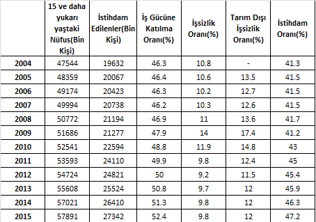

## 1. İş Sağlığı ve Güvenliği
Toplumsal ve ekonomik bir sorun olan "İş Sağlığı ve Güvenliği" konusunun ortaya çıkması 18. yüzyılın sonlarına, sanayileşmenin yayılmaya başladığı döneme rastlamaktadır. İş güvenliği ile ilgili ilk uygulamalarda esas amaç "üretim sürekliliğinin sağlanması" olmuştur. Diğer bir deyimle, "çalışma koşullarının iyileştirilmesi" yerine "kazalanan veya hastalanan işçinin kısa sürede iyileştirilip tekrar işinin başına döndürülmesi" hedeflenmiştir. "Tedavi edici" nitelikteki bu uygulamalar uzun süre devam etmiştir.

## 2. İş Güvenliğinin Amaçları
İş Güvenliği; iş yerlerinde, işin yürütülmesi ile ilgili olarak oluşan tehlikelerden, sağlığa zarar verebilecek koşullardan korunmak ve daha iyi bir iş ortamı yaratmak amacıyla yapılan sistemli ve bilimsel çalışmalar olarak tanımlanmaktadır.

İş Güvenliği'nin Temel Amaçları;
* Çalışanları korumak,
* Üretim güvenliğini sağlamak,
* İşletme güvenliğini sağlamaktır.

Günümüzde, işçilerin sağlık ve güvenlikleri ile ilgili önlemler belirlenirken İş Güvenliği kavramı esas alınmakta; "Hastalık veya kazayı meydana getiren nedenlerin ortadan kaldırılması"na yönelik uygulamalara gidilmektedir.

## 3. Çalışma Koşullarının İyileştirilmesi, Görevler
Çalışma koşullarının iyileştirilmesi açısından devlet, işveren, işçi ve sendika dörtlüsünün işbirliği içinde çalışması gerekir. Çünkü;
* Devlet, vatandaşlarına mutlu ve sağlıklı yaşam koşullarını sağlamakla yükümlü olduğu,
* İşverenler maddi ve manevi çıkarları,
* İşçiler, doğrudan doğruya canları yanan kişiler olmaları,
* Sendikalar, üyelerinin hak ve menfaatlerini koruma yükümlülüğünü taşıdıkları için konuya sahip çıkmak zorundadırlar.

## 4. Nüfus Yaş Yapısı, Çalışabilir Nüfus

Her yıl konuyla ilgili (iş kazaları, meslek hastalıkları, iş göremezlik oranları, kayıp iş günü sayıları vb.) istatistikler yayınlanmaktadır. İstatistikler değerlendirilirken nüfus miktarı kadar önem taşıyan bir başka kriter de ülkenin "Nüfus Yaş Yapısı"dir. Bu terim bir nüfus kitlesinin belirlenmiş yaş gruplarına göre bileşim durumunu tanımlar.

Nüfusun yaş gruplarına bölünüp analiz edilmesi, her şeyden önce çalışabilir ve çalışmayan nüfusun ortaya çıkartılmasında son derece önemlidir.

### 4.1. Nüfusun Yaşa Göre Sınıflandırılması
Birleşmiş Milletler ölçütlerine ve İLO Değerlendirmelerine göre;
* 0-14 yaşları arasındakiler çocuk veya genç nüfus
* 15-64 yaşları arasındakiler yetişkin, çalışabilir veya faal nüfus
(15-25 yaşları arasındakiler genç çalışan, 45-64 yaşları arasındakiler yaşlı çalışan)
* 65 yaş ve üzeri ise yaşlı nüfus

olarak sınıfılandırılır.

### 4.2. Dünya Nüfusu, Toplam İşgücü ve İşgücüne Katılma Oranı
Dünya nüfusu 2012 yılı için yaklaşık 7 milyar olarak verilmektedir. Aynı yıl için Toplam İşgücü 3,2 milyar, İşgücüne Katılma Oranı da %64'tür.

## 5. Dünya'da İş Kazaları ve Meslek Hastalıkları
ILO'nun (International Labour Organisation - Uluslararası Çalışma Örgütü) 2005 yılı verilerine göre; Dünyada her yıl 270 milyon iş kazası meydana gelmekte, 160 milyon kişi meslek hastalıklarına yakalanmaktadır. Her gün yaklaşık 6 bin kişi iş kazası veya meslek hastalıkları nedeniyle yaşamını kaybetmektedir. İşe bağlı ölümlerin beşte dördü meslek hastalıları nedeniyle meydana gelmektedir. Her yıl yaklaşık 360 bin kişi iş kazası, 1 milyon 750 bin kişi meslek hastalıklarından ölmektedir. 

### 5.1. İş Kazalarının Maliyeti
ILO, iş kazaları sonucunda ölüm oranını ortalama 100.000'de 14 olarak tahmin etmektedir. En yüksek ölüm oranları gelişmekte olan ülkelerde gerçekleşmektedir. Avrupa ülkelerinde ise ölüm oranı 100.000 işçide 6'dır. İş kazası ve meslek hastalıklarının mali boyutu ülkelerin Gayrisafi Yurtiçi Haslılasının (GSYH) %1'i ile %4'ü arasında değişmektedir. İş kazaları ve meslek hastalıklarının dünya ekonomisine maliyeti 2009 yılı rakamlarıyla dünyanın Gayri Safi Milli Hasılası'nın yaklaşık %4'üne, yani 1.2 trilyon dolarlık bir ekonomik büyüklüğe karşı gelmektedir.

## 6. Türkiye'de İşgücü Temel Göstergeleri
Türkiye'de 2004-2015 yılları arasında işgücü ile ilgili temel göstergeler Çizelge 1'de verilmiştir. Görüldüğü gibi, 2012 yılında İşgücü 27339000 olup, İŞgücüne Katılma Oranı %50, İstihdam Oranı %45.4'tür.

## 7. Türkiye'de İş Kazaları ve Meslek Hastalıkları
SGK (Sosyal Güvenlik Kurumu) istatistiklerine göre; 2012 yılında SGK'ya bağlı olarak çalışan işçi sayısı 12 milyon civarındadır. 2012 yılında 74.871 iş kazası, 395 meslek hastalığı olayı meydana gelmiş ve bu olaylar sonucunda 745 çalışan hayatını kaybetmiştir. 2012 yılında kaydedilen iş kazalarından 9209'u (%12.3) inşaat sektöründe, 8828'si (%11.79) kömür madenciliğinde, 7045'i metal ürünleri imalatında meydana gelmiştir. Aynı yıl içinde iş kazaları (2036 kişi) ve meslek hastalıkları (173 kişi) nedeniyle toplam 2209 kişi sürekli iş göremez duruma düşmüştür.

2012 yılında iş kazaları ve meslek hastalıkları sonucu kaybedilen iş günü sayısı ise ayakta tedavilerde 1599618, yatarak tedavi nedeni ile 50632 iş günü olmak üzere, geçici iş göremezlik nedeni ile toplam 1650250 iş günüdür. İş kazaları ve meslek hastalıkları sonucu 745 kişi hayatını kaybederken, 2209 kişi sürekli iş göremez duruma düşmüştür. Her bir ölüm ve sürekli iş göremezlik için 7500 iş günü kaybedildiği kabul edilirse, ölüm ve sürekli iş göremezlik nedeni ile 22155000 iş gününün, toplam olarak 23805250 iş gününün kaybedildiği görülmektedir. 

Türkiye 2012 yılında 786.3 milyar dolar GSYH ile dünyanın 17. büyük ekonomisine sahiptir. Bu değerden hareketle iş kazaları ve meslek hastalıklarının maliyeti yaklaşık 31 milyar dolark olarak hesaplanır. Bu rakamların yanı sıra SGK istatistiklerine yansımayan iş kazaları ve meslek hastalıkları sonucu kayıplar da ayrıca dikkate alınmalıdır. Türkiye'de çalışan nüfus 2012 yılı için yaklaşık 26 milyonu bulurken iş kazası ve meslek hastalığı potansiyeli sadece 12 milyon SGK'lı açısından kayıt altına alınmaya çalışılmaktadır. Bu kesimin içine dahi SGK'ya bildirilmeyen ölümler ve yaralanmalar olduğu bilinmektedir. Hepsi doğru olsa bile rakamlar işgücünün %45'i üzerinden hesaplanmaktadır. Türkiye buna rağmen iş kazalarında Avrupa'da 1. ve Güney Kore ile Brezilya'nın ardından Dünyada 3. olmayı sürdürmektedir.

Meslek hastalıkları ile ilgili kayıtlar daha da yetersizir. Ülkeler arasında bazı farklılıklar olmakla birlikte, yılda her bin işçiden 4-12'sinin meslek hastalığına yakalnma ihtimali olduğu bilinmektedir. Örneğin; Belçika'da 6 bin, İtalya'da 54 bin, Almanya'da 84 bin ve Amerika Birleşik Devletleri'nde 400 bin civarında meslek hastalığı tespit edilmiştir. Buna göre, Türkiye'de 2012 yılında SGK'ya kayıtlı sigortalı çalışan sayısı (11939620) üzerinden bir hesaplama yapıldığında 47.758 - 143.275 arasında meslek hastalığı beklenmektedir. Ancak, SGK istatistiklerine göre 2012 yılında kayıtlara geçen meslek hastalığı sayısı 395'tir.