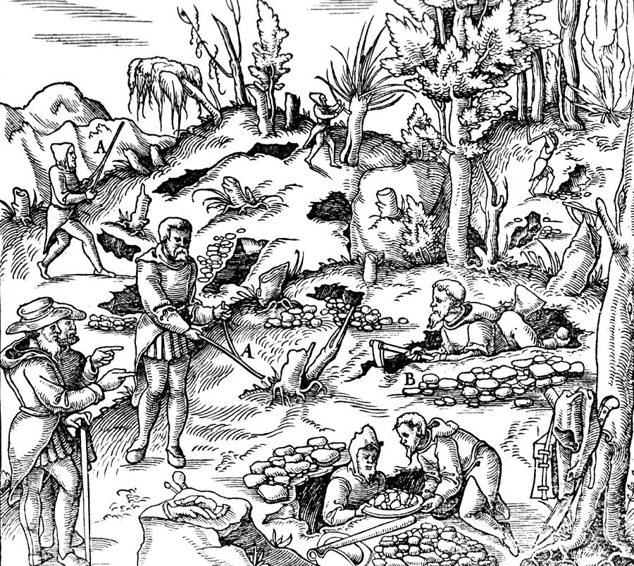

# 1. Dünyadaki Tarihsel Gelişmeler
Dünyada iş sağlığı ve güvenliği ile ilgili veriler MÖ 500 yıllarına kadar gitmektedir. Ünlü tarhçi ve düşünür Heredot (MÖ 484 - 425) çalışanların verimli olabilmeleri için iyi beslenmeleri, düzenli dinlenmeleri ve uyumaları gerektiğini söylemiştir. Ünlü hekim Hipokrates (MÖ 460 - 377), kurşunun zararlı etkilerine değinmiş ve kurşun zehirlenmesinin başlıca belirtilerinden bahsetmiştir. Hipokrates'in çalışmalarını geliştiren Nicander (MÖ 197 - 130), kurşun koliği (bağırsak düz kaslarının kasılması sonucu çok şiddetli karın ağrıları) ve kurşun anemisini (kansızlık, hemoglobin değerinin düşük olması) incelemiş ve bunların özelliklerini tanımlamıştır.

Pliny (MS 23-79), çalışanların ortamdaki tehlikeli tozlara karşı korunması amacıyla, maske yerine geçmek üzere başlarına bir torba geçirmelerini önermiştir. Juvenal (MS 60-140), özellikle demircilerde izlenen gözle ilgili yakınmaların ve göz hastalıklarının yapılan işten kaynaklandığını belirtmiş, uzun süre ayakta durarak çalışanlarda varislerin olabileceğini açıklamıştır.

Paracelsus (1493-1541) iş hekimliği alanındaki ilk monografi sayılan "De Morbis Metallicis (Maden Hastalıkları)"'i yazmıştır. Bu kitapta madenciler ve dökümcülerde görülen hastalıkların klinik bulguları hastalık adı verilmeden anlatılmıştır. Bu bulgular pnömokonyozları tanımlamaktadır. Paracelsus'a göre, "Tüm maddeler birer zehirdir. Aralarında zehir olmayanı yoktur, zehir ve devayı birbirinden ayıran ise doz"dur.

Mineraloji biliminin babası olarak kabul edilen Georgius Agricola (1494-1555) tıp eğitimi görmüş olmasına rağmen madencilik, metalürji, jeoloji, mineraloji konularında da kapsamlı çalışmalar yapmıştır. Elde ettiği bulgular 1556 yılında, 12 ciltlik "De re Metallica" adlı kitabında yayınlanmıştır. Kitapta yer alan, madencilik çalışmaları ile ilgili temsili resim Şekil 1'de verilmiştir. Madenlerde ve metalürji işyerlerinde çalışanlarda görülen hastalıkları tanımlamış ve alınması gerekli önlemleri belirtmiştir. Tozu önlemek için maden ocaklarının havalandırılması gerektiğini belirtmiş, iş kazaları ve iş güvenliği yöntemleri konusunda önerilerde bulunmuştur.

İtalyan hekim Bernandio Ramazzini (1633-1714), 1713 yılında yayınladığı "De Morbis Artificium Diatriba (Çalışanların Hastalıkları) adlı kitabında, iş kazalarının önlenmesi için alınması gereken koruyucu tedbirleri belirtmiş ve çeşitli iş kollarında görülen meslek hastalıklarını tanıtmıştır. Çalışma ortamından kaynaklanan olumsuz koşulların düzeltilmesi ile iş veriminin artacağını ileri sürmüştür. Ergonominin temel ilkelerini açıklamıştır.

"Hastalara mesleklerini sorunuz" diyen Ramazzini'yi eşsiz kılan tıp bilimine kazandırdığı şu evrensel kuraldır: "Meslek hastalıkları iş yeri ortamında incelenir; hastane koğuşlarında değil..."

İngiliz hekim Percival Pott (1714-1788), 1775 yılında baca temizleyicileri arasında, topluma oranla çok daha sık görülen skrotum (testis torbası) kanserlerinde başlıca nedenin iş olduğunu ileri sürmüştür. İngiliz hekim Thomas Percival (1740-1804), genç işçilerin çalışma süreleri ve koşulları hakkında bir rapor hazılamıştır. Bu rapor bir işveren ve parlamenter olan Sir Robert Peel'i etkilemiş ve parlamentoda girişimlerde bulunarak 1802 yılında "Çırakların Sağlığı ve Morali" adlı yasanın çıkarılmasını ısağlamıştır. İngiltere'de iş sağlığı ve güvenliği ile ilgili olarak çıkartılan bu ilk yasada, çalışma süresi günde 12 saat olarak sınırlandırılmış, işyerlerinin havalandırılması öngörülmüştür.

İngiliz hekim Charles Turner Thackrah (1795-1833) İngiltere'de meslek hastalıkları konusunda ilk kitabı yazmıştır. Bu çalışmalardan etkilenen Michel Sadler 1832 yılında parlamentoya yeni bir yasa önerisi getirmiş ve 1833 yılında "Fabrikalar Yasası" adı altında yürürlüğe girmesini sağlamıştır. Bu yasa ile fabrikaların denetimi için müfettiş atanması zorunlu kılınımış, 9 yaşının altındaki çocukların işe alınması ve 18 yaşından küçüklerin ise 12 saatten fazla çalıştırılması yasaklanmıştır. 1842 yılında yapılan başka bir yasal düzenleme ile de kadınların ve 10 yaşından küçük çocukların maden ocaklarında çalıştırılmaları yasaklanmıştır. 1847'de çıkarılan "On Saat Yasası" ile kadın ve genç işçilerin tekstil sektöründeki günlük çalışma süreleri on saat ile sınırlandırılmıştır. 1895 yılında ise bazı tehlikeli meslek hastalıklarının bildirimi zorunlu hale getirilmiştir.

Aynı dönemde, endüstrileşmenin getirdiği ağır ve tehlikeli çalışma koşullarının düzeltilmesi için ABD'de eyalet hükümetleri kendi bünyelerinde gerekli önlemleri alma konusunda yektilendirilmişlerdir. Bu konuda ilk çalışmalar Massachusetts Eyaleti'nde yapılmıştır. 1836 yılında çocuk işçiler ile ilgili bir yasa çıkarılmış, 186 yılında özel denetim yasasını uygulamak için bir örgüt kurulmuştur. ABD'de iş sağlığı ve güvenliği ile ilgili çalışmaların gelişmesinde bir hekim olan Alice Hamilton (1869-1970)'un rolü büyüktür. Ömrünün 40 yılını mesleki riskler ve meslek hastalıklarının incelenmesi konularına harcamıştır. Kurşun sanayiinde görülen zehirlenmelerle ilgili incelemeleri, çalışma koşullarının düzeltilmesi konusunda yaptığı öneriler işverenlerin tepkisini çekmiştir.

Çalışanlar 19. yüzyıldan itibaren iş sağlığı ve güvenliği ile ilgili yasaların hazırlanması ve yaptırımlar uygulanması konusunda çeşitli etkinliklerde bulunmuşlardır. Sosyal güvenlik ilkeleri on dokuzuncu yüzyılda yaygınlaşmış, çeşitli sigorta kurumları kurulmuş ve iş kazaları ile meslek hastalıkları sigortası uygulanmaya başlamıştır. Dünyadaki meslek hastalıkları ve iş kazalarının önlenmesine yönelik çalışmalarda sendikaların katkıları yanında, 1919 yılında faaliyete başlayan "Uluslararası Çalışma Örgütü" (ILO: International Labour Organisation)" de bu konuda önemli çalışmalar yapmış ve 1946 yılında Birleşmiş Milletler ile imzaladığı anlaşma sonucu bir uzmanlık kuruluşu durumuna gelmiştir.

ILO'nun merkezi İsviçre-Cenevre'dedir. 2007 yılı itibariyle ILO'ya üye 180 ülke bulunmaktadır. 40'ı aşkın ülkede ILO'nun bölge, alan ve ülke ofisleri oluşturulmuştur. ILO'nun genişletilmiş politikaları, her yıl toplanan Uluslararası Çalışma Konferansı'nda belirlenmektedir. Konferansın yıllık oturumları arasındaki ILO çalışmaları ise 28 hükümet temsilcisi ile 14 işçi ve 14 işveren temsilcisinden oluşan Yönetim Kurulu tarafından sürdürülmektedir.

ILO'nun dört temel stratejik hedefi vardır.
* Çalışma yaşamında standartlar, temel ilke ve haklar geliştirmek ve gerçekleştirmek,
* Kadın ve erkeklerin insana yakışır işlere sahip olabilmeleri için daha fazla fırsat yaratmak,
* Sosyal koruma programlarının kapsamını ve etkinliğini arttırmak,
* Üçlü yapıyı ve sosyal diyalogu güçlendirmek.

# 2. Türkiye'deki Tarihsel Gelişmeler
## 2.1. Cumhuriyet Öncesi Dönem
Osmanlı Devleti'nin kuruluş ve yükselme devirlerinde, çalışma hayatı ile ilgili düzenlemeler kent esnafının ve küçük çaplı üretim yapan zanaatkarların örgütlediği Loncalar'da gerçekleştirilmiştir. Lonca düzeni 15. yüzyılın sonlarında ortaya çıkmış, 18. yüzyılın ortalarına doğru "Gedik" şeklini alarak 20. yüzyıl başlarına kadar varlığını sürdürmüştür. Osmanlı Devleti'nin son yarım yüzyıllık döneminde şer'i mahkemelerde hukuki dayanak olarak Mecelle esas alınmıştır. Mecelle İslam dünyasının ilk Medeni ve Borçlar Kanunu'dur. Doğrudan çalışma ilişkileri alanını düzenlemek amacıyla çıkarılmamasına karşılık, 1926 yılına kadar, Osmanlı İmparatorluğu'nda bireysel iş ilişkilerinin hukuksal çerçevesini çizmiştir.

Osmanlı dönemindeki ilk sanayi kuruluşları; III. Selim (1789-1807) döneminde kurulan Beykoz Kağıt ve Çuha Fabrikaları (1805) ve II. Mahmud (1808-1839) döneminde kurulan Eyüp İplik Fabrikası (1810), Beykoz Deri ve Kundura Fabrikası (1816), Feshane, Tophane Kereste ve Bakır Levha Fabrikası, Tophaneye bağlı Top Döküm ve Dolmabahçe Tüfek Fabrikası'dır. Bu sanayi kuruluşlarının devreye girmesi ile birlikte, temel hammadde olan kömüre olan talep de hızla artmıştır. Bir deniz eri olan Uzun Mehmet'in 1829 yılında Karadeniz Ereğlisi, Köseağzı Mevkii, Niren Deresi yatağında taşkömürü bulunması Osmanlı Devleti ekonomisinde önemli bir gelişme olmuştur.

1848-1865 yılları arasında havzanın işletme hakkı İngiliz kökenli Galatalı sarrafların kurduğu "Kömür Kumpanyası"na verilmiştir. Bahriye Nezareti dönemi 1865-1908 yıllarını kapsamaktadır. Bu dönemde Gürcü, Fransız, Alman, Belçika, İtalyan kökenli şirketler bölgede kömür üretimi yapmışlardır. Maden Nazırlığına getirilen Mirliva (Tuğamiral) Dilaver Paşa, damarları adlandırmak, ocakları sınıflandırmak, ocakların idare şeklini düzenlemek, çalışanların sağlık ve güvenliği ile ilgili önlemleri belirlemek üzere 8 bölüm ve 100 maddeden oluşan bir "Nizamnanme (Tüzük)" hazırlamıştır.

1867 tarihinde yürürlüğe giren "Dilaver Paşa Nizamnamesi" bu açıdan havzada çalışma hayatını düzenleyen iş hukuku konusundaki ilk mevuzattır. Nizamnamenin çalışma koşulları ile ilgili 5. bölümü, ocaklarda çalışacak işçilerin ereğli Sancağı'ndan 13-50 yaşları arasındaki sağlam erkeklerden alınacağı, 24 saatte 10 saat çalışılacağı, bu 10 saatin iki nöbette tamamlanacağı, kömür taşıma işinden kaçanlara ya da bir başkasının kaçmasına yardım edenlere iki kat süreyle çalışma zorunluluğu getirileceği vb. gibi kurallar içermektedir.

Dilaver Paşa Nizamnamesi'nden iki yıl sonra 1869'da "Maadin Nizamnamesi" yürürlüğe girmiştir. Nizamnameini iş güvenliği ile ilgili başlıca maddeleri şunlardır.

* Zorunlu çalışma yönteminin kaldırılması ve işçilerin kendi rızalarıyla, hak ettikleri ücreti alarak çalışmaları,
* Maden mühendislerinin ocaklardaki tehlikeleri belirleyerek maden sahibini uyarmaları,
* Maden mühendislerinin tehlikelere karşı gerekli önlemleri alması,
* Maden sahiplerinin iş kazalarını derhal hükümete haber vermesi,
* Kaza durumunda, kazaya maruz kalanlara veya ailesine mahkeme tarafından hükmedilecek tazminatın işveren tarafından ödenmesi,
* Kaza, işverenin kötü yönetim veya denetimi ile gereken önlemlerin yerine getirilmemesinden kaynaklanıyorsa, maden sahibinin ayrıca 5 ile 20 altın ceza alması,
* Madenlerde diplomalı hekim çalıştırılması ve bir eczane bulundurulması.

## 2.2. Türkiye Büyük Millet Meclisi Dönemi
Türkiye Büyük Millet Meclisi'nin açılışını (23 Nisan 1920) izleyen hükümet kurma döneminin ilk aylarında (02 Mayıs 1920), Zonguldak Kömür Havzası'nın stratejik önemi dikkate alınarak, madencilik faaliyetlerini düzenlemek için harekete geçilmiştir. İlk olarak, 28.04.1921 tarih ve 114 sayılı; "Zonguldak ve Ereğli Havzalarındaki Kömür Tozlarının İşçi Yararına Satılmasına Dair Kanun" çıkarılmıştır.

İkinci olarak, 10.09.1921 tarihinde, 151 sayılı "Ereğli Kömür Havzası İşçilerin Hukuku ile İlgili Kanun" yürürlüğe girmiştir. Toplam 15 maddeden oluşan Kanun, o günün şartları dikkate alındığında çalışanların maden sahiplerine karşı haklarının koruması ve daha insanca bir yaşam sürmeleri konularında devrim olarak nitelendirilebilecek hükümler içermektedir. Kanunun 4. maddesinde Ereğli Bölgesi'nde çalışan işçiler için işçi ve işverenden alınacak aidatlarla "İhtiyat ve Teavün Sandıkları (Tasarruf ve Yardımlaşma Sandıkları)" kurulması, hastalık halinde işçi ve ailesine bu sandıktan yardım sağlanması öngörülmüştür. Sigortalılık bölge işçileri için zorunlu hale getirilmiştir.

## 2.3. Cumhuriyet Dönemi