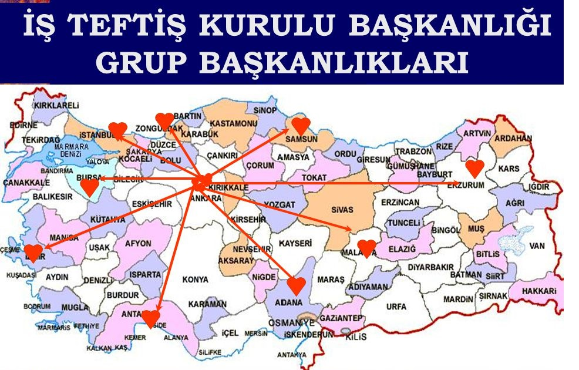

# 1. İSG'nin Temel Amaçları
* Çalışanları korumak (sağlık, güvenlik ve refahlarını sağlamak ve geliştirmek),
* Üretimin devamlılığını sağlamak,
* İşletmenin devamlılığını sağlamak,
* Verimi artırmaktır. 

# 2. İSG Konusunda Taraflar
**DEVLET:** Ülke adı verilen belirli bir toprak üzerinde yaşayan insan topluluklarının bir egemenlik anlayışı ve hukuku içinde bir siyasi iktidar altında örgütlenmesidir.

**İŞVEREN:** Bir iş sözleşmesine dayanarak işçi çalıştıran gerçek veya tüzel kişi yahut tüzel kişiliği olmayan kurum ve kuruluşlardır.
*4857 sayılı İş Kanunu (KKT: 22.05.2003, RGT: 10.06.2003, RGS: 25134) Madde 2.* Yani işveren gerçek kişi olabileceği gibi şirket, dernek, vakıf, kooperatif, sendika gibi özel veya kamu hukuku tüzel kişisi de olabilir. İşveren sayılmada en önemli unsur işçi çalıştırma durumudur. İşçi çalıştırmayan kişilerin iktisadi faaliyetleri iş hukuku açısından önem taşımaz. 

**İŞÇİ:** Bir iş sözleşmesine dayanarak çalışan gerçek kişilerdir. *4857 sayılı İş Kanunu (KKT: 22.05.2003, RGT: 10.06.2003, RGS: 25134) Madde 2.*

**SENDİKA:** İşçilerin veya işverenlerin çalışma ilişkilerinde, ortak ekonomik ve sosyal hak ve çıkarlarını korumak ve geliştirmek için en az yedi işçi veya işverenin bir araya gelerek bir iş kolunda faaliyette bulunmak üzere oluşturdukları tüzel kişiliğe sahip kuruluşlardır.

**KONFEDERASYON:** Değişik işkollarında en az beş sendikanın bir araya gelerek oluşturdukları tüzel kişiliğe sahip kuruluşlardır. *6356 sayılı Sendikalar ve Toplu iş Sözleşmesi Kanunu (KKT: 18.10.2012, RGT: 07.11.2012, RGS: 28460) Madde 2.*

# 3. İSG Konusunda Devletin Görev ve Sorumlulukları
* Mevzuatı Oluşturmak
* Teşkilatlanma,
* Rehberlik ve Danışmanlık,
* Mevzuatın Uygulanmasını Denetlemek,
* İstatistiki Bilgiler ve Yayınlar Sunmak. 

## 3.1. Mevzuatı Oluşturmak
Çalışanların ve toplumun güvenlik ve sağlığı, işin ve üretimin sağlıklı ve güvenli bir şekilde yürütülmesi amacıyla devlet İSG alanında gerekli mevzuatı oluşturur.
Mevzuat;
* Anayasa,
* Uluslararası Sözleşmeler,
* Yasalar,
* Tüzükler,
* Yönetmelikler, 
* Tebliğler ve
* Standartlardan oluşmuştur. 
* Anayasa *(2, 5, 17, 50, 56, 60. Maddeler)*
* Uluslararası sözleşmeler *(81 No'lu ILO sözleşmesi)*
* İş Kanunları ve İlgili Tüzük / Yönetmelikler
* Borçlar Kanunu *(332. Madde)*
* Sosyal Sigortalar ve Genel Sağlık Sigortası Kanunu *(3. Bölüm - KVSK)*
* Umumi Hıfzıssıhha Kanunu *(173 - 180. Maddeler)*
* Belediyeler Kanunu *(38. Madde)*

## 3.2. Teşkilatlanma
* Çalışma ve Sosyal Güvenlik Bakanlığı
* Sağlık Bakanlığı
* Milli Savunma Bakanlığı
* Çevre ve Orman Bakanlığı
* İçişleri Bakanlığı
* Bayındırlık ve İskan Bakanlığı
* Sanayi ve Ticaret Bakanlığı
* Enerji ve Tabii Kaynaklar Bakanlığı
* Türkiye Atom Enerjisi Kurumu (TAEK)
* Devlet Planlama Teşkilatı (DPT)
* Türk Standartları Enstitüsü (TSE)

## 3.3. Rehberlik ve Danışmanlık
İş sağlığı ve güvenliği alanında, gerçek ve tüzel kişilerin talepleri doğrultusunda;
* İş Sağlığı ve Güvenliği Genel Müdürlüğü (İSGGM)
* İş Sağlığı ve Güvenliği Merkezi (İSGÜM),
* Çalışma ve Sosyal Güvenlik Eğitim ve Araştırma Merkezi (ÇASGEM) danışmanlık ve rehberlik hizmetlerini sunmaktadır.

### 3.3.1. İSGGM
24.07.2003 tarihli Resmi Gazetede yayımlanarak yürürlüğe giren 4947 sayılı Sosyal Güvenlik Kurumu Kuruluş Kanunu'nun 12'nci maddesi uyarınca İşçi Sağlığı Daire Başkanlığı, İş Sağlığı ve Güvenliği Genel Müdürlüğü olarak yeniden yapılandırılmıştır. **Görevleri;** iş sağlığı ve güvenliği konularında, mevzuatın uygulanmasını sağlamak ve mevzuat çalışması yapmak, ulusal politikalar belirlemek, bu politikalar çerçevesinde programlar hazırlamak, ulusal ve uluslararası kurum ve kuruluşlarla işbirliği ve koordinasyonu sağlamak, yayın ve dokümantasyon çalışmaları yapmak ve istatistikleri düzenlemek, işyerindeki sağlık ve güvenlik risklerini önlemek ve koruyucu hizmetleri yürütmek üzere görevlendirilecek işyeri hekimleri, iş güvenliği uzmanları ve diğer görevlilerin iş sağlığı ve güvenliği ile ilgili eğitim ve belgelendirme usul ve esaslarını belirlemektir. 

### 3.3.2. İSGÜM
İş sağlığı ve güvenliğinin sağlanması görevi, 1945 yılında kurulan "Çalışma Bakanlığı" bünyesinde "İşçi Sağlığı Genel Müdürlüğü"'ne verilmiştir. Türkiye Cumhuriyeti Hükümeti, Birleşmiş Milletler Kalkınma Programı Özel Fon İdaresi ve ILO temsilcileri arasında 1968 tarihinde imzalanan "İşçi Sağlığı ve Güvenliği Özel Fon Projesi ön Uygulama Anlaşması" onaylanarak, 26 Mart 1969 tarih ve 6/11568 sayılı Bakanlar Kurulu kararı ile İş Sağlığı ve Güvenliği Genel Müdürlüğü'ne bağlı olarak "İş Sağlığı ve Güvenliği Merkezi (İSGÜM)" kurulmuştur. **Görevleri;** İş sağlığı ve güvenliği alanında saha ve laboratuvar araştırmaları yapmak ve öneriler geliştirmek, standart ve normlar hazırlamak, hedef kitleler için iş sağlığı ve güvenliği eğitimleri planlamak, yayın ve dokümantasyon yapmaktır.

### 3.3.3. ÇASGEM
Bu kuruluş ilk olarak 1955 yılında "Yakın ve Orta Doğu Çalışma Enstitüsü (YODÇE)" adı altında İLO'nun bir bürosu olarak İstanbul'da faaliyete geçmiştir. 1960 yılında Çalışma Bakanlığı'na bağlanmıştır. YODÇE yeniden yapılandırılarak merkezin yeni ismi "Çalışma ve Sosyal Güvenlik Eğitim ve Araştırma Merkezi (ÇASGEM)" olarak değişmiş ve Merkezin Yasası 24 Temmuz 2003 tarih ve 25178 sayılı Resmi Gazete'de yayınlanmıştır. **Görevleri;** Güvenli bir çalışma ortamı sağlamak, işyerlerinde her türlü kaza ve yaralanmaları önlemek, tüm kazaları ve meslek hastalıklarını en alt düzeye indirmek, çalışanlar ile çalıştıranların sosyal güvenliklerini, iş hukuku açısından hak ve yükümlülüklerini öğreterek, iş barışını sağlamak, böylece ulusal ekonomiye ve kalkınmaya destek vermektir. 

## 3.4. Mevzuatın Uygulanmasını Denetlemek
* Çalışma hayatı ile ilgili mevzuat çerçevesinde programlı veya program dışı teftiş, inceleme, soruşturma yapmak, gerekli önlemleri almak veya aldırmak,
* Uluslararası sözleşmeler çerçevesinde iş yerlerinde uygulamaları incelemek ve izlemek,
* Çalışma hayatı ile ilgili mevzuatın uygulanmasını izlemek amacıyla İş Teftiş Kurulu Başkanlığı hizmet sunmaktadır.

4857 sayılı İş Kanunu, Madde 91 - Devlet, çalışma hayatı ile ilgili mevzuatın uygulanmasını izler, denetler ve teftiş eder. Bu ödev Çalışma ve Sosyal Güvenlik Bakanlığı'na bağlı ihtiyaca yetecek sayı ve özellikte teftiş ve denetlemeye yetkili iş müfettişlerince yapılır. İş Teftişi, İş Teftiş Kurulunca yürütülür. 28.08.1979 tarih ve 16738 sayılı Resmi Gazete'de yayınlanan "İş Teftişi Tüzüğü" ile Çalışma Bakanlığı (13 Aralık 1983 tarih ve 184 sayılı KHK ile "Çalışma ve Sosyal Güvenlik Bakanlığı") "İş Teftiş Kurulu Başkanlığı" fiilen kurulmuştur. İş Teftiş Kurulu, Bakanlık makamına bağlı olup, teftişe yetkili bir başkanla baş iş müfettişi, iş müfettişi ve iş müfettiş yardımcılarından oluşur. İş denetimlerinin tüm ülke genelinde gerektiği şekilde yürütülebilmesi için 10 bölgede "Grup Başkanlıkları" kurulmuştur.

Grup Başkanlıklarının bulunduğu iller ve başkanlıklar kapsamındaki iller bir harita üzerinde gösterilmiştir. 

İş Teftiş Kurulu Başkanlığı'nın görevleri İş Teftiş Tüzüğü Madde 10'da aşağıdaki şekilde belirlenmiştir:
1. Çalışma hayatıyla ilgili mevzuatın uygulanmasını denetlemek, 
2. İş teftişiyle ilgili mevzuat çalışması yapmak ve mevzuatta görülen boşluk ve aksaklıkların giderilmesi için alınması gerekli önlemler konusunda görüş bildirmek,
3. İş teftişiyle ilgili istatistikleri tutmak, değerlendirmek, yorumlamak ve yayınlanmasını sağlamak,
4. Mevzuatta öngörülen ve bakanlık makamınca verilen diğer işleri yapmak. 

## 3.5. İstatistiksel Bilgiler ve Yayınlar Sunmak
İş kazası ve meslek hastalıkları ile ilgili SGK İstatistikleri, çalışma hayatı ile ilgili olarak bakanlığın diğer birimleri tarafından toplanan veriler her yıl yayınlanmaktadır. 

# 4. İSG Konusunda İşverenin Görev ve Sorumlulukları
**İş Kanunu**
*Kanun No.: 4857, Kabul Tarihi: 22. 05. 2003, Bölüm 5, Madde 77*
* Mevzuat hükümlerini uygulamak ve iş sağlığı ve güvenliğinin sağlanması için gerekli her türlü önlemi almak, araç ve gereçleri noksansız bulundurmak,
* İşçileri karşı karşıya bulundukları mesleki riskler, alınması gerekli tedbirler, yasal hak ve sorumlulukları konusunda bilgilendirmek,
* Gerekli iş sağlığı ve güvenliği eğitimini vermek,
* Alınan iş sağlığı ve güvenliği önlemlerine uyulup uyulmadığını denetlemek,
* İşçileri alınacak güvenlik önlemlerine uymaya zorlamak, 
* İşyerlerinde meydana gelen iş kazasını ve tespit edilecek meslek hastalığını en geç üç iş günü içinde yazı ile ilgili bölge müdürlüğüne ve SGK'ya bildirmek zorundadır. Ayrıca iş kazalarını yetkili kolluk kuvvetlerine derhal bildirmek zorundadır. 

**İş Sağlığı ve Güvenliği Kanunu**
*Kanun No.: 6331. Kabul Tarihi: 20. 06. 2012, Bölüm 2, Madde 4, 5, 6, 7, 8, 9, 10, 11, 12*
* İşveren, iş sağlığı ve güvenliği yönünden risk değerlendirmesi yapmak veya yaptırmak,
* Acil durum planları, yangınla mücadele ve ilk yardım planları yapmak,
* Ciddi, yakın ve önlenemeyen tehlikenin meydana gelmesi durumunda; çalışanların işi bırakarak derhal çalışma yerlerinden ayrılıp güvenli bir yere gidebilmeleri için, önceden gerekli düzenlemeleri yapmak ve çalışanlara gerekli talimatları vermek. 

## 4.1. Mevzuat Hükümlerini Uygulama ve İş Güvenliği Önlemlerini Alma
İş sağlığı ve iş güvenliği konusunda işverene düşen en önemli görev mevzuatı uygulama yükümlülüğüdür. İşveren İş Kanunu'na tabi bir yer işletiyorsa bu yasanın getirdiği hükümlere, İş Kanunu kapsamı dışında kalan bir yer işletiyorsa Borçlar Kanunu ile getirilen hükümlere uymak zorundadır. 4857 Sayılı İş Kanunu Madde 77'de; "İşverenler işyerlerinde iş sağlığı ve güvenliğinin sağlanması için gerekli her türlü önlemi almak, araç ve gereçleri noksansız bulundurmak, işçiler de iş sağlığı ve güvenliği konusunda alınan her türlü önleme uymakla yükümlüdürler. 

### 4.1.1. İş Sağlığı ve Güvenliği Kurulu İşyeri Hekimi, İşyeri Sağlık Birimi
* **İş Kanunu Madde 80** - Bu Kanuna göre sanayiden sayılan, devamlı olarak en az elli işçi çalıştıran ve altı aydan fazla sürekli işlerin yapıldığı işyerlerinde her işveren bir iş Sağlığı ve Güvenliği Kurulu kurmakla yükümlüdür.
* **İş Kanunu Madde 81** - Devamlı olarak en az elli işçi çalıştıran işverenler, Sosyal Sigortalar Kurumunca sağlanan tedavi hizmetleri dışında kalan, işçilerin sağlık durumunun ve alınması gereken iş sağlığı ve güvenliği önlemlerinin sağlanması, ilk yardım ve acil tedavi ile koruyucu sağlık hizmetlerini yürütmek üzere işyerindeki işçi sayısına ve işin tehlike derecesine göre bir veya daha fazla İşyeri Hekimi çalıştırmak ve bir İşyeri Sağlık Birimi oluşturmakla yükümlüdür.

### 4.1.2. Mühendis veya Teknik Eleman
**İş Kanunu Madde 80** - Bu Kanuna göre sanayiden sayılan, devamlı olarak en az elli işçi çalıştıran ve altı aydan fazla sürekli işlerin yapıldığı işyerlerinde işverenler, işyerinin iş güvenliği önlemlerinin sağlanması, iş kazalarının ve meslek hastalıklarının önlenmesi için alınacak önlemlerin belirlenmesi ve uygulanmasının izlenmesi hizmetlerini yürütmek üzere işyerindeki işçi sayısına, işyerinin niteliğine ve tehlikelilik derecesine göre bir veya daha fazla Mühendis veya Teknik Elemanı görevlendirmekle yükümlüdürler.

## 4.2. İşçileri Eğitme
İşyerinde sadece önlemlerin alınmış olması genellikle tehlikeyi ortadan kaldırmaz. Bu önlemlere uyulması, tehlikelerin önceden sezinlenmesi, tekniğin getirdiği yeniliklerin öğretilmesi için eğitim zorunludur. Eğitim, sadece işçinin işe alınması sırasında yapılmamalı, çalışma yeri ve iş değişikliğinde, iş araçlarının ve üretim tekniklerinin yenilenmesi sırasında işçiler yeniden eğitime tabi tutulmalıdır. Buradan da anlaşıldığı üzere, işverenin işçilerini eğitme görevi süreklilik göstermelidir.

## 4.3. Denetleme
Bir görevin yolunda yürütülüp yürûtülmediğini anlamak için yapılan araştırma, denetim, bakı, teftiş olarak tanımlanmaktadır. Her alanda olduğu gibi, iş güvenliğinin de temeli denetimdir. Çalışanların olumlu özelliklerini geliştirmek, hata olasılığını azaltmak, eksiklikleri zamanında belirleyerek risk oluşturmadan önlemleri almak vb. ancak iyi bir denetim mekanizmasının kurulmasıyla sağlanabilir. Devletin tüm iş yerlerini bir müfettiş görevlendirerek denetlemesi mümkün değildir. Dolayısıyla devamlı olarak işin başında bulunan işveren denetim görevini de üstlenmek durumundadır.

## 4.4. İşçileri Alınacak Güvenlik Önlemlerine Uymaya Zorlama
İş güvenliğinin sağlanması için konuyla ilgili önlemlerin alınması yeterli değildir. İşçilerin de alınan önlemlere aynen uymaları gerekir. İşverenin, önlemlere uyma konusunda savsaklama gösteren işçileri uymaya zorlama görev ve yetkisi bulunduğu kabul edilmelidir. 4857 sayılı İş Kanunu'nun 25 Maddesi II/i bendi gereğince "İşçinin kendi isteği veya savsaması yüzünden işin güvenliğini tehlikeye düşürmesi, işyerinin malı olan veya malı olmayıp da eli altında bulunan makineleri, tesisatı veya başka eşya ve maddeleri otuz günlük ücretinin tutarıyla ödeyemeyecek derecede hasara ve kayba uğratması" durumunda işverenin haklı nedenle iş sözleşmesini derhal fesih hakkı doğmaktadır. 

# 5. İSG Konusunda İşçilerin Görev ve Sorumlulukları
İşçilerin iş sağlığı ve güvenliği konularındaki görevleri pasif niteliktedir. Dolayısıyla işçilerin bu konularda yerine getirmesi gereken bir önlem bulunmamaktadır. İşçiler sadece alınmış olan önlemlere uymak ve tehlikeli bir durum yaratmamak için gereğinden de fazla dikkatli ve tedbirli davranmak ve çalışmak zorundadırlar. 6331 sayılı İş Sağlığı ve Güvenliği Kanunu, Madde 19 gereğince; Çalışanlar, iş sağlığı ve güvenliği konusunda aldıkları eğitim ve işverenin bu konudaki talimatları doğrultusunda, kendilerinin ve hareketlerinden veya yaptıkları işten etkilenen diğer çalışanların sağlık ve güvenliklerini tehlikeye düşürmemekle yükümlüdür.

Çalışanların, işveren tarafından verilen eğitim ve talimatlar doğrultusunda yükümlülükleri şunlardır:
* İşyerindeki makine, cihaz, araç, gereç, vb. üretim araçlarını kurallara uygun şekilde kullanmak, bunların güvenlik donanımlarını doğru olarak kullanmak, keyfi olarak çıkarmamak ve değiştirmemek.
* Kendilerine sağlanan kişisel koruyucu donanımı doğru kullanmak ve korumak.
* İşyerindeki makine, cihaz, araç, gereç, tesis ve binalarda sağlık ve güvenlik yönünden ciddi ve yakın bir tehlike ile karşılaştıklarında ve koruma tedbirlerinde bir eksiklik gördüklerinde, işverene veya çalışan temsilcisine derhal haber vermek.
* Teftişe yetkili makam tarafından işyerinde tespit edilen noksanlık ve mevzuata aykırılıkların giderilmesi konusunda, işveren ve çalışan temsilcisi ile iş birliği yapmak.
* Kendi görev alanında, iş sağlığı ve güvenliğinin sağlanması için işveren ve çalışan temsilcisi ile iş birliği yapmak. 

# 6. İSG Konusunda Sendikaların Görev ve Sorumlulukları 
6356 sayılı "Sendikalar ve Toplu İş Sözleşmesi Kanunu"'na göre; sendikalar, işçilerin veya işverenlerin çalışma ilişkilerinde, ortak ekonomik ve sosyal hak ve çıkarlarını korumak ve geliştirmek için en az yedi işçi ve işverenin bir araya gelerek bir iş kolunda faaliyette bulunmak üzere oluşturdukları tüzel kişiliğe sahip kuruluşlardır. Sendikalar ve Toplu iş Sözleşmesi Kanunu, Madde 26'da sendikaların faaliyetleri belirtilmiştir.
* Kuruluşlar, çalışma hayatından, mevzuattan, örf ve adetten doğan uyuşmazlıklarda işçi ve işverenleri temsilen; sendikalar, yazılı başvuruları üzerine iş sözleşmesinden ve çalışma ilişkisinden doğan hakları ile sosyal güvenlik haklarında üyelerini ve mirasçılarını temsilen dava açmak ve bu nedenle açılmış davada davayı takip yetkisine sahiptir.
* Kuruluşlar, faaliyetlerinden yararlanmada üyeleri arasında eşitlik ilkesi ve ayrımcılık yasaklarına uymakla yükümlüdür. Kuruluşlar, faaliyetlerinde toplumsal cinsiyet eşitliğini gözetir.
* Kuruluşlar, tüzükleriyle belirlenen amaçları dışında faaliyette bulunamaz.
* Kuruluşlar ticaretle uğraşamaz. Ancak, kuruluşlar genel kurul kararıyla nakit mevcudunun yüzde kırkından fazla olmamak kaydıyla sanayi ve ticaret kuruluşlarına yatırımda bulunabilir.
* Kuruluşlar elde ettikleri gelirleri üyeleri ve mensupları arasında dağıtamaz. Ancak sendikaların grev ve lokavt süresince tüzüklerine göre üyelerine yapacakları yardımlar ile kuruluşların eğitim amaçlı yardımları bu hükmün dışındadır.
