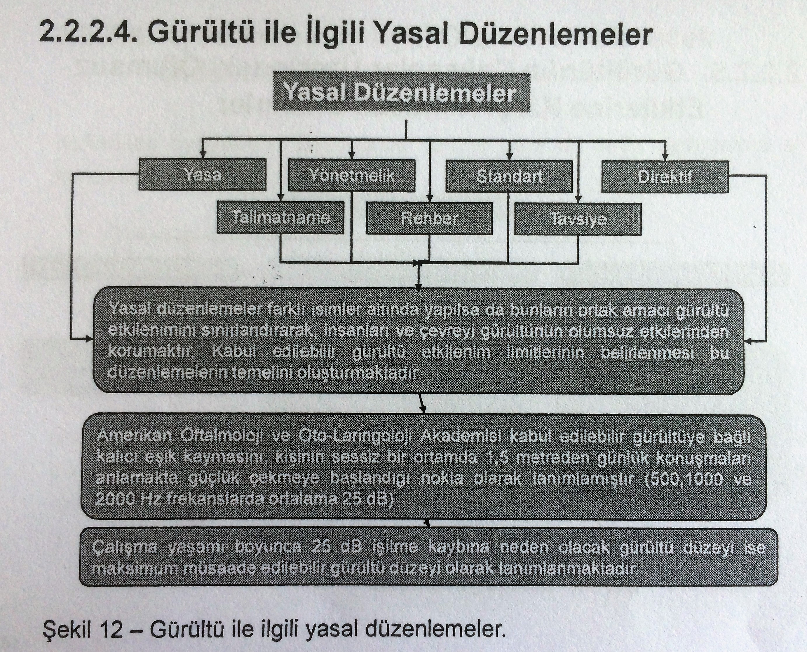

# 1. Giriş
Birçok ulusal ve uluslararası mevzuatta kişilerin sağlıklı bir ortamda yaşama ve çalışma hakları ile ilgili düzenlemeler bulunmakta olup bir bölümü aşağıda sıralanmıştır. Ayrıca 4857 sayılı iş Kanunu'na dayanarak hazırlanmış olan yönetmeliklerde de çalışanları etkileyen iş ortamından kaynaklanacak tehlikeler ve zarar verebilecek koşullar belirtilmiş, alınacak önlemler vurgulanmıştır.
* Anayasa, Madde 56,
* İnsan Hakları Evrensel Bildirgesi, Madde 23 ve 25,
* 4857 sayılı İş Kanunu ve kanuna dayanarak çıkarılan yönetmelikler, 
* 6331 sayılı İş sağlığı ve Güvenliği Kanunu,
* 155 ve 161 sayılı ILO Sözleşmeleri,
* 89/391 sayılı AB Çerçeve Direktifi

Bu bölümde iş ortamında çalışanları etkileyen temel faktörler incelenmiştir. 

# 2. İş Ortamında Çalışanları Etkileyen Faktörler
Çalışanları etkileyen işyeri ortamı ile ilgili temel faktörler dört başlık altında toplanabilir.
* Kimyasal Faktörler,
* Fiziksel Faktörler,
* Biyolojik Faktörler,
* Sosyal ve Psikolojik Faktörler.

## 2.1. Kimyasal Faktörler
Kimyasal maddeler sadece kimya endüstrisi ile sınırlı kalmayıp, diğer birçok iş kolunda bazen ana bazen de yardımcı girdi şeklinde yoğun olarak kullanılmaktadır. Örneğin; petrol ve kömür türevleri, plastikler, boyar maddeler, tıbbi ve tarımsal ilaçlar, kimyasal gübreler, çeşitli solventler (çözücü) vb. ürünlerin üretildiği kimya endüstrisinin yanında, tekstil, selüloz ve kağıt, demir - çelik ve demir dışı metaller, cevher zenginleştirme, yapı malzemeleri, otomotiv gibi iş kollarında kimyasal maddelerin kullanılması nedeniyle kimyasal kirlilik olması ve çalışanların sağlığı bakımından potansiyel bir risk oluşturması söz konusudur. 

Kimyasal faktörleri aşağıdaki gibi beş ana başlık altında toplamak mümkündür.
* Metaller
* Asit ve Alkaliler
* Çözücüler
* Zehirli Gaz ve Buharlar
* Pestisitler 

### 2.1.1. Metaller
#### a. Kurşun
Kurşun, çalışma ortamındaki buharların ve havadaki küçük kurşun partiküllerinin solunması ile vücuda girebilir. Ayrıca besin maddelerine karışarak veya kurşun bulaşan suların içilmesiyle de alınabilir. Kurşun vücuttaki hemen hemen tüm organ ve dokuları etkiler. En duyarlı sistem, özellikle de çocuklar için, merkezi sinir sistemidir. Ayrıca böbreklerde ve bağışıklık sisteminde de hasara neden olur. Cilt ile teması herhangi bir tehlike oluşturmaz. EPA (Environmental Protection Agency)'ya göre havada kurşun miktarının 1,5 ug/m3'ü, içme suyunda ise 15 ug/m3'ü geçmemesi gerekir.
#### b. Kadmiyum
Kadmiyum havadan solunarak, kadmiyumlu kaplarda saklanan besinlerin tüketilmesi ile, sigara dumanından, kadmiyumla kirlenmiş suların içilmesiyle vücuda alınabilir. Yüksek düzeyde kadmiyumun solunması akciğer hasarına bağlı olarak ölüme neden olabilir. Hava, su ya da besinler yoluyla düşük düzeyde kadmiyuma uzun süre maruziyet sonucunda kadmiyum böbreklerde birikir ve böbrek hastalıkları ortaya çıkabilir. EPA içme sularında 5 ppb (milyarda 5)'in aşılmaması gerektiğini bildirmektedir. FDA'ya göre yiyecekler için bu düzey 15 ppb'dir.
#### c. Krom
Üç ana şekilde (Krom 0, Krom III, Krom IV) bulunabilen krom bileşikleri tatsız ve kokusuzdur. Sadece Krom III bileşikleri vücut için diyetle eser miktarlarda alınması gerekli elementlerdir. Havadan solunarak, suyla ve besinlerle vücuda alınabilir. Yüksek miktarlarda solunması burun, akciğer, mide ve bağırsaklara zarar verebilir. Uzun süre yüksek ve orta düzeylerde maruziyet burun kanaması, yaraları, akciğer hasarı ve kanser dışındaki akciğer hastalıklarında artışa neden olabilir. Sindirim yoluyla yüksek düzeylerde alınırsa mide şikayetleri ve ülsere, konvülsiyonlara (bilinç kaybı, kasların istemsiz ve şiddetli bir şekilde kasılıp gevşemesi), böbrek ve karaciğer hastalıklarına, hatta ölüme neden olabilir.
#### d. Cıva
Solunum ve sindirim yoluyla vücuda girer. Cıva doğada bozulmadığından cıva ve cıva bileşikleri halk ve çevre sağlığı bakımından çok tehlikeli ve toksittir. İçme suyu veya gıda zinciri yolu ile insan vücuduna giren cıva; nörolojik bozukluklara, merkezi sinir sisteminin tahribine ve kansere, böbrek, karaciğer, beyin dokularının tahribine, kromozomları tahrip edip sakat doğumlara neden olmaktadır. Başlıca belirtiler, iştahsızlık, dişetlerinde ağrı, titreme, uykusuzluk ve çeşitli ruhsal bozukluklardır. 

### 2.1.2. Asit ve Alkaliler
#### a. Asitler
Sanayide yaygın olarak kullanılan asitler arasında, hidroklorik asit (HCl), sülfrik asit (H2SO4), nitrik asit (HNO3), hidroflorik asit (HF), fosforik asit (H3PO4), siyanür asidi (HCN), asetik asit (CH3COOH) vb. sayılabilir. Tüm asitler aşındırıcı, yakıcı ve delici etkiye sahiptir. Solunum, sindirim ve deri yoluyla etki ederler. Buharları ağız, göz, solunum yolları ve akciğerlerde tahribata neden olur. Sindirim yolu ile alınma durumunda yemek borusu, mide ve bağırsaklarda kanamalar meydana gelir. Deri ile temas etmeleri durumunda kolaylıkla iyileşmeyen ağır yaralar oluşur. Asitlik derecesi arttıkça etkiler hızlanır ve tahribat büyür.
####  b. Alkaliler
Alkaliler de asitlerde olduğu gibi solunum, sindirim sistemleri ve deri üzerinde tahribat yaparlar. Kuvvetli alkalilerin toz veya çözeltileri özellikle gözlerde ve mukozada tahribat oluşturur. Yüksek konsantrasyonlarda ölüme neden olabilir. En çok tanınan alkalilerden olan sodyum hidroksit ve potasyum hidroksit gözler için çok tehlikelidir. Değmesi, sıçraması veya uzun süreli temas durumlarında körlüğe varan olumsuz sonuçlar ortaya çıkabilir. 

### 2.1.3. Çözücüler
Çalışanların çözücülerden etkilenmesi, solunum, sindirim ve deri teması ile olur. Solunum yolu ile etkilenme, çözücü buharlarının solunumu ile gerçekleşir. Genellikle çözücü madde bulaşmış besinlerin yenmesi veya yanlışlıkla içilmesi sonucu sindirim sistemi etkilenir. Deri ile direkt olarak temas eden madde deri tarafından absorblanarak kana karışabilir. Çözücüler, deri, gözler, akciğer, karaciğer ve sinir sistemi üzerinde etkili olurlar. Deri ve akciğerler yoluyla beyne ulaşabilirler. İlk belirtiler baş dönmesi, baş ağrısı, yorgunluk, anlama yeteneğinde azalmadır. Değişik çözücülerin birlikte etkisinde kalma, her çözücünün yaptığı etkiden daha fazla olumsuz etki oluşturur. 

### 2.1.4. Zehirli Gaz ve Buharlar
#### a. Boğucu Gazlar: 
Boğucu etkilerini ya ortam havasındaki oksijenin yerini alarak, ya da oksijenin havadaki miktarını azaltarak oluştururlar. Metan, etan, bütan, karbondioksit, hidrojen ve azot gazları bu gruba girer. Havadaki yoğunluklarına göre, baş ağrısı, baş dönmesi, bulantı, görme bozuklukları vb. neden olurlar.
#### b. Kimyasal Etkili Boğucu Gazlar: 
Boğucu etkilerini vücutta kimyasal reaksiyona girerek gösterirler. Bu gruba giren gazlara örnek olarak karbonmonoksit, hidrojensülfür vb. verilebilir. Örneğin; hidrojensülfür, kendine özgü özel kokusu ile hemen fark edilir. Ancak kısa süre içinde koku alma sinirlerini felce uğratır ve kokusu algılanamaz. Solunum yoluyla alındığında tahriş edici öksürüklere neden olur. Gözlerde ve genizde hissedilir şekilde yanma etkisi gösterir.
#### c. Tahriş Edici Gazlar: 
Kükürtdioksit, azot oksitleri, amonyak ve asit buharlan bu gruba örnek olarak gösterilebilir, özellikle üst solunum yollarında tahriş edici, yakıcı etki gösterirler. Örneğin azotdioksit, etkisini nitrik asit oluşturarak gösterir ve üst solunum yollarında tahribat yapar. Fazla miktarda solunması durumunda akciğerlerde önemli hasarlar meydana gelebilir.
#### d. Sistemik Etki Gösteren Zehirli Gazlar: 
Karbonsülfür, arsenikli hidrojen ve çeşitli metal buharları örnek olarak verilebilir. Bazıları oda sıcaklığında sıvı oldukları halde, endüstride genellikle buhar şeklinde karşılaşılır. 

### 2.1.5. Pestistler
Tarımsal ürünleri hastalık ve zararlılardan koruyan zirai mücadele ilaçları, yani pestisitler, insanlar ve çevre üzerinde de olumsuz etkiler oluştururlar. İmalat, ambalajlama, taşıma, uygulama ve ürünlerin toplanması sırasında çeşitli yollarla insan bünyesine giren pestisitler kronik zehirlenmelere neden olmaktadır. Genellikle organik fosforlu bileşikler, pyretroidler akut zehirlenme meydana getirdiği halde, organik klorlu bileşikler kronik zehirlenmeye neden olmaktadır. 

### 2.1.6. Kimyasal Faktörlerin Etkileri
Kimyasal Yanıkların çoğu asit ve aklali kaynaklıdır. Yaralanan organ çoğunlukla gözdür. Zehirlenmeler ise zararlı gazlardan dolayıdır. MSHA tarafından 1999 - 2006 arasını kapsayan bir diğer araştırmada ise 2705 kazanın nedeni 66 farklı kimyasal etmendir. 

Kimyasal faktörlerin iş kazalarına etkisi
Total number ol nonfatal injury cases and those caused by chemical burns and poisonings for 1986 through 1995 (NOSH, 2060). 

| Operators | All nonfatal | Chemical burns | Poisonings |
|----|----|----|----|
| Coal | 131,144 | 701 | 244 |
| Metal | 31,494 | 733 | 166 |
| Nonmetal | 17,133 | 239 | 103 |
| Stone | 54,359 | 1,132 | 217 |
| Sand and gravel | 19,406 | 127 | 141 |
| Totals | 253.536 | 2,932 | 871 |

| Year | Number | Year | Number |
|----|----|----|----|
| 1999 | 394 | 2003 | 317  |
| 2000 | 382 | 2004 | 279  |
| 2001 | 344 | 2005 | 322  |
| 2002 | 388 | 2006 | 279  |
|     |  |  Total:| 2,705 |

2705 kazanın;
%39'u asit ve alkali,
%28'i ocak tozları,
%13'ü kimyasallar,
%8'i kömür ve petrol ürünleri kaynaklıdır.

2705 kazanın;
%57'si kimyasal yanıklar, 
%24'u pnömokonyoz,
%8'i zehirlenme,
%3'ü deri yanıkları,
%2'si silikoz'a neden olmuştur.

### 2.1.7. Kimyasal Faktörlerin Etkilerinden Korunma
Çalışanların, yaptıkları işten kaynaklanan kimyasal faktörlerin olumsuz etkilerinden korunabilmesi için öncelikle bazı verilerin saptanması gerekir. Bunlar şu şekilde gruplandırılabilir.
* Çalışanların işyeri ortamında ilişkide bulundukları kimyasal bileşikler nelerdir?
* Bu bileşikler hangi kaynaklardan ortama yayılmaktadır ve ortam havasındaki miktarları nedir?
* Çalışanlar ne kadar süre ile bu ortamda bulunmaktadırlar?
* İyileştirme ve koruma önlemleri nelerdir? 

#### a. Kimyasal Maddelerin Saptanması
Her şeyden önce işyerinde, hangi maddelerle çalışılmakta olduğu belirlenir ve bunların kimyasal bileşimleri saptanır. Ayrıca işlem sırasında oluşan yeni kimyasal bileşiklerin ortama yayılıp yayılmadığı incelenir.
#### b. Yayılma Noktasının ve Ortamdaki Yoğunluğun Saptanması 
İşyerinde sağlık sorunu yaratacak maddeler belirlendikten sonra bunların hangi işlemler sırasında ve işyerinin hangi bölgelerinde ortaya çıktığının saptanması gerekir. Bu izleme işlemi, kolay sonuç veren, taşınabilir ölçme aletleri ile gerçekleştirilir. Bunun yanı sıra incelemenin yapıldığı ortamda çalışan kişilerden alınan kan, idrar vb. biyolojik materyal de incelenerek, çalışanların söz konusu maddeden etkilenme dereceleri belirlenir. 
#### c. Etkilenme (Maruziyet Süresi)
Kimyasal ve fiziksel faktörler ancak belli işlemler sonucu ortaya çıkarlar. Bu nedenle çalışanların etkilenme süreleri 8 saatten daha azdır. Ancak hesaplamalar genellikle en uzun süre (8 saat) üzerinden yapılır.

### 2.1.8. İyileştirme ve Korunma Önlemleri
#### a. Kaynakta Alınacak Önlemler
Bu gruba giren önlemler arasında; sorun yaratan faktörün yayılmadan çalışanlara zarar vermeyecek hale getirilmesi ya da ortama yayılmasının engellenmesi yer alır.
Başlıcaları:
* Zararsız veya daha az zararlı maddelerin kullanılması,
* İşlemin değiştirilmesi,
* Islak yöntemler kullanılması,
* Uygun havalandırma sistemi kullanılmasıdır.

#### b. Çalışma Ortamında Alınacak Önlemler 
* İşyerinde düzen ve temizlik,
* Genel havalandırma,
* Seyreltme havalandırması,
* Dedektörler ile sürekli kontrol.

#### c. Çalışan Üzerinde Alınacak Önlemler
* Eğitim,
* Rotasyon ve ekip değişimi,
* Kişisel dozimetreler (dozölçer),
* Kişisel koruyucular,
* İşe giriş muayeneleri ve periyodik (süreli) tıbbi kontroller. 

## 2.2. Fiziksel Faktörler
* İklim
* Gürültü 
* Aydınlatma 
* Titreşimler 

### 2.2.1. İklim
Çalışma ortamının iklimi denilince üç ayrı büyüklüğün birlikte etkisi anlaşılır. Bunlar;
* Sıcaklık (Kuru, Yaş ve Efektif Sıcaklıklar), 
* Nem (Mutlak ve Bağıl Nem),
* Hava hızıdır.

Sıcaklık ve nem, kısaca havanın ısısı olarak da tanımlanmaktadır. 

#### 2.2.1.1. Isı Göstergeleri ve Standartları
##### a. Kuru Hazne Sıcaklığı (tk)
Normal termometrelerle, kısa sürede ölçülebilen bir büyüklüktür. Ancak çalışanların ısı zorlanmasını tam olarak yansıtmadığı için tek başına kullanılmamaktadır. Gelişmiş endüstri ülkelerinde, hafif fiziksel işlerin yapıldığı iş yerlerinde çalışanların büyük bir bölümünün kendilerini rahat hissettikleri sıcaklık 18 °C olarak belirlenmiştir. Büro çalışmaları gibi az hareket gerektiren işleri yapanlar (19.5 - 23 °C) arasındaki sıcaklıkları tercih ederlerken, ağır endüstriyel işlerde çalışanların kendilerini rahat hissettikleri sıcaklık sınırları (13 - 15.5 °C) olarak belirlenmiştir. 

##### b. Yaş Hazne Sıcaklığı (ty)
Haznesinin üzeri ıslak bir pamuklu bez ile örtülmüş olan termometrenin göstermiş olduğu değerdir. Havanın nem alabilme kapasitesini belirlediğinden, organizmadan buharlaşma (terleme) yoluyla ısı yayılımını denetler. Tek başına kullanılabilecek bir psikrometrik büyüklüktür. 

##### c. Nem (Rutubet)
Havadaki su buharının miktarı olan nem iki farklı şekilde ifade edilmektedir.
* Mutlak Nem: Beher m3 hava içindeki su buharının gr cinsinden miktarıdır (gr/m3)
* Bağıl Nem (Relatif Nem): Belli bir sıcaklıkta, havadaki su buharı kısmi basıncının, doymuş durumdaki havanın su buharı kısmi basıncına yüzdelik oranıdır.

Uygulamada genellikle Bağıl Nem esas alınır. Genelde havadaki bağıl nem miktarının %70'ten yukarı çıkmaması gerekir. 

##### d. Hava Hızı
Hava hareketlerinin fark edilmesinde, hareket halindeki havanın insan vücuduna çarpması sonucu deride oluşturduğu ısı değişiklikleri rol oynar. Hareketli havanın sıcaklığı düşük olduğu zaman şikayetler artar. Bunun nedeni insan bedeninin soğuğa karşı daha duyarlı olmasıdır. Hava akımının hızı aynı kaldığı halde ortam ısıtılırsa şikayetlerin azaldığı görülür. Ortam sıcaklığı ve çevreden ısı yayılımı normal sınırlar içinde ise, az hareket gerektiren işlerde ideal hava hızı 0.15 m/sn civarındadır. Hava hızı 0.5 m/sn'nin üzerine çıktığı zaman çalışma ortamı esintili kabul edilir. Kuru ve yaş sıcaklıklar, nem ve hava hızı ölçümünde kullanılan ölçme aletleri şunlardır; kuru, yaş sıcaklıklar (psiktrometre), bağıl nem (saç higrometresi), hava hızı (anemometre, katermometre). 

##### e. Efektif Sıcaklık (Etkin Sıcaklık) (tef)
Bu konudaki araştırmaların temel amacı, ortam sıcaklığı ve nemlilik derecesi, radyant ısı, hava hızı gibi faktörlerin yanı sıra, böyle bir ortamda çalışan insanların görüşlerini de (sübjektif değerlendirme) dikkate alarak, çalışma ortamına en uygun iklim koşullarını formüle edebilmektir. Diğer bir deyimle farklı iş türleri için geçerli kriterler aranmaktadır. Kuru, yaş hazne sıcaklıkları ve hava hızı biliniyorsa, Efektif Sıcaklık nomogramından elde edilebilir.

Bu tür indekslerin en basiti Efektif Sıcaklık (Etkin Sıcaklık) olarak tanımlanan değerdir. Yukarıdaki kriterleri dikkate alan bu indeks daha sonra çevrenin radyasyon etkisi de dikkate alınarak düzeltilmiş ve Düzeltilmiş Etkin Sıcaklık İndeksi (Corrected Effective Temperature - CET) olarak kullanılmaya başlamıştır. Her ülke kendi standartlarını kendi koşullarına göre belirlemiştir. Örneğin Güney Afrika'da limit değer 28°C yaş sıcaklıktır. Bazen kuru ve yaş sıcaklık farkı standart olarak kullanılabilmektedir. 2 - 3 °C sıcaklık farkı arzulanan bir farktır.

Yeraltı ocaklarında havanın soğutma gücü nedeniyle hava hızı da standartların saptanmasında önem kazanmaktadır. Bazı hallerde hava hızı tek başına veya yaş sıcaklık ile birlikte "rahatlık" kavramının tanımlanmasında kullanılır. Havanın soğutma gücü ve çalışma koşulları açısından 1.0 - 2.5 m/sn hava hızı uygun değerlerdir. Zira hava hızının artması (2.5 - 3.0 m/sn) başta toz olmak üzere diğer bazı olumsuz etkilenmelere neden olmaktadır. Eski Sovyetler Birliği'nde limit çalışma sıcaklığı 26 °C, Ingiltere'de 28 °C olarak belirlenmiştir. İngiltere'de eğer işçi 28 °C'dan daha yüksek sıcaklıkta çalışmak zorunda ise ek ücret ödenmektedir. Federal Almanya'da ise limit sıcaklık değerleri çalışma süresine bağlı olarak belirlenmiştir. 

#### 2.2.1.2. İklimin İş Verimi ve İş Güvenliği Üzerindeki Etkisi
Standart değerlerin belirlenmesinde etkin sıcaklığın veya yaş sıcaklığın kullanılması bunların iş verimine doğrudan etki etmelerinden dolayıdır. Şekilde yaş sıcaklık ile iş verimi arasındaki ilişki verilmektedir. Görüldüğü gibi yaş sıcaklığın 32 °C ve hava hızının 0.51 m/sn olduğu koşullarda verim %20'den fazla azalmaktadır.

Şekilde Güney Afrika altın madenlerinde 1973 - 75 yılları arasında yapılan bir araştırmaya dayanılarak çizilmiş bir grafik görülmektedir. Derin yeraltı ocaklarında kurulmuş olan klima tesisleri aracılığıyla meydana getirilen soğutma gücü (watt/m2) arttıkça (işçiler açısından normal çalışma koşullarına yaklaşıldıkça) üretkenliğin arttığı görülmektedir. 

Benzer bir değerlendirme iş güvenliği açısından da yapılabilir. Bu konuda Hindistan'da Kolar Bölgesi'ndeki Ooregum Altın Madeninde yapılan bir araştırmanın sonuçları Şekilde verilmiştir.

#### 2.2.1.3. İklimin Çalışanlar Üzerinde Fizyolojik Etkileri
İnsan vücudunun tam istirahat halinde ve temel yaşam fonksiyonlarını devam ettirebilmesi için gereken, en düşük enerji harcama düzeyi Bazal Metabolizma olarak tanımlanır. Sağlıklı ve 70 kg ağırlığındaki bir insanın Bazal Metabolizması 1700 kcal/gün civarındadır. Kasların çalışması daha fazla enerji harcanmasına neden olur. Kastaki iş yükü ortadan kalktığında, enerji gereksinimi zamanla dinlenme durumundaki düzeyine iner. Lehman, oturarak yapılan işler için, bazal metabolik enerji gereksiniminin üzerine 0,3 kcal /dk, ayakta yapılan işler için 0,6 kcal/dk'lık ilave enerji hesaplanmasını önermiştir. Her iki değer de çok kaba yaklaşımlardır. Vücutta üretilen enerjinin % 25'i yaşamsal fonksiyonları desteklemek için; geriye kalan % 75'i vücudun ısısını muhafaza etmek için kullanılır. İnsan vücudu "vücut ısısını düzenleyen ve sıcaklığını sabit (37 °C) civarında tutan mükemmel bir kontrol sistemine sahiptir. Organizmadan ısı transferi iletim (kondüksiyon), taşınım (konveksiyon) , terleme ve buharlaşma (evaporasyon) ve ışınım (radyasyon) ile olmaktadır. Bunlar arasında konveksiyon (% 25 - 30) ve radyasyon (%40 - 60) ısı transferi açısından ayrı bir önem taşır. 

#### 2.2.1.4. İklimin Olumsuz Etkilerine Karşı Alınabilecek Önlemler
##### a. Sıcak Ortam Stresi (Isı Stresi)
Çalışma sahalarında iklimin olumsuz etkileri daha çok yüksek sıcaklığın neden olduğu Isı Stresi şeklinde gözlenmektedir. Madencilik sektörü açısından, derin yer altı ocakları ve sıcak iklim kuşağında bulunan açık ocaklardaki iklim şartları buna örnek olarak verilebilir. Yüksek sıcaklığın vücudun direncini azalttığı, iş verimini düşürdüğü, kramplara ve ısı çarpmasına neden olduğu bilinmektedir. En önemli ve tehlikeli sonuç ısı çarpmasıdır. Vücut sıcaklığı 40 °C'ye ulaşır veya üzerine çıkarsa, terleme durur, cilt kurur ve yüzeyi buruşuk bir görünüm kazanır. Bedensel ve ruhsal tükenme, sık ve yüzeysel solunum, hafif ve sık nabız buna eşlik eder. Durum kısa sürede fark edilip, hasta, ortamdan uzaklaştırılmazsa olay ölümle sonuçlanabilir. Vücudun ısı düzenleme mekanizmasını desteklemek için aşağıda belirtilen önlemlerin alınması gerekmektedir.
* Giyim
* Hava Hareketi 
* Ortama Uyum Sağlama 
* Diğer Önlemler

##### b. Soğuk Ortam Stresi
Organizma, vücut sıcaklığının sınırlı ölçüde düşürülmesine uzun süre dayanabildiği halde, aynı ölçüdeki sıcaklık yükselmeleri ısı stresi yaratmaktadır. Bu nedenle soğuk çalışma ortamlarına ait sorunlar, sıcak ve nemli iş ortamlarına oranla daha kolay çözülebilmektedir. Soğuk ortamda çalışma insanların enerji gereksinimini arttırmakta ve beslenme alışkanlıklarını değiştirmektedir, özellikle fazla enerji veren aşırı yağlı besinlere ve karbonhidratlara yönelen bu insanların zamanla vücutlarındaki yağ oranının arttığı kilo aldıkları, savunma mekanizmalarını harekete geçiren organizmanın bu şekilde kendini soğuğa karşı koruduğu bilinmektedir. 

### 2.2.2. Gürültü
#### 2.2.2.1. Gürültü ile İlgili Temel Büyüklükler
##### a. Ses Basıncı ve Ses Basınç Seviyesi
Ses titreşimlerinin atmosfer basıncında meydana getirdiği değişimlere akustik basınç ya da ses basıncı denir. Simgesi "P" birimi ise Paskal "Pa"dır. Statik atmosfer basıncı ile karşılaştırıldığında işitilebilir ses basıncı çok küçütür ve 20 uPa (10-6 Pa) ile 100 Pa arasındadır. Genç ve sağlıklı bir insan kulağı 20 uPa civarındaki ses basıncını algılayabilir ve bu değere duyma eşiği denir. 100 Pascal'lık ses basıncı ise acı duyma eşiğidir. 0.00002 N/m2'lik standart referans ses basınç seviyesine (0 dB) oranlanan ses basınç seviyesinin birimi Desibel (dB)dir. Ses basıncının Paskal biriminden desibel birimine dönüştürülmesiyle elde edilen büyüklüğe Ses Basınç Seviyesi denir.

Lp = 20xlog[P1/P0]

Lp: Ses basınç seviyesi (dB),
p1: Ses basıncı (N/ m2),
p0: Referans ses basıncı (2x10^-5 N/m^2)'dir.

Desibel ölçeği duyma eşiği (20 nPa) ile ağrı eşiği (100 Pa) arasındaki büyük değer farkını, kullanım açısından basit, yararlı ve uygulama kolaylığı getiren 0 dB ile 140 dB aralığına dönüştürmektedir.

##### b. Sesin Frekansı
Ses frekansı birim zamanda bir titreşim kaynağı tarafından havada meydana getirilen titreşimlerin sayısı olarak tanımlanmaktadır. Frekans birimi Hertz olup (Hz) simgesi ile gösterilir. Sağlıklı ve genç bir insan kulağı 20 Hz ile 20 kHz arasındaki frekanslara sahip sesleri duyabilmektedir. Bu bölgeye "İşitilebilir Frekans Aralığı" denir. 1 ile 20 Hz frekans aralığı "Infrasonik Frekanslar” olarak adlandırılır. Duyulamazlar fakat titreşimler şeklinde hissedilebilirler. 20.000 - 40.000 Hz frekans aralığı "Ultrasonik Frekanslar" olarak adlandırılır.

#### 2.2.2.2. Gürültünün Ölçülmesi
Gürültü ölçerlerin en temel parçaları, mikrofon, yükseltici, ağırlık şebekeleri ve gösterge'dir. Mikrofon gelen akustik sinyalleri elektrik sinyallerine dönüştürmektedir. Mikrofondan gelen elektrik sinyalleri ön yükseltici tarafından uygun bir seviyeye yükseltilir. Yükseltilmiş bu sinyaller daha sonra ağırlık şebekeleri tarafından modifiye edilerek A, B ve C ağırlıklı ses düzeyleri göstergeden dB biriminde elde edilir. Bir ses düzeyi ölçerde gösterge ayarları gürültü türüne ve istenen ölçme zamanına bağlı olarak hızlı tepkili (FAST), yavaş tepkili (SLOW) ve ani tepkili (IMPACT) şeklinde olabilir. İş yeri gürültü seviyesi ölçümleri için genellikle yavaş tepkili ölçüm daha uygundur. 

#### 2.2.2.3. Gürültünün Çalışanlar Üzerindeki Etkileri
##### Etkileri
* **Fiziksel Etkiler:** İşitme duyusunda meydana getirdiği olumsuz etkilerdir. Bu etkiler geçici veya kalıcı işitme kayıplarıdır.
* **Fizyolojik Etkiler:** Kan basıncının artması, kas gerilmeleri, stres, kalp atışlarının değişmesi, gözbebeği büyümesi, uykusuzluk, solunumda hızlanma, vücut aktivitesinde değişiklikler, dolaşım bozuklukları, ani refleksler.
* **Psikolojik Etkiler:** Davranış bozuklukları, sinir sisteminde bozukluklar, korku, rahatsızlık, yorgunluk, zihinsel işlevlerde yavaşlama.
* **Performans Etkileri:** İş verimini azaltması ve seslerin anlaşılabilirliğini bozması gibi etkileridir. Gürültünün iş verimliliğini ve üretkenliğini olumsuz yönde etkilediği araştırmalarla saptanmıştır. İşyerlerindeki gürültü düzeyi ile verimlilik arasında anlamlı bir ilişki vardır.

##### Dereceleri
* **1. Derece (30-65 db):** Konforsuzluk, rahatsızlık, öfke, kızgınlık, uyku düzensizliği ve konsantrasyon bozukluğu.
* **2. Derece (65-90 db):** Fizyolojik reaksiyonlar, kan basıncı artışı, kalp atışlarında ve solunumda hızlanma, beyin sıvısındaki basıncın azalması, ani refleksler.
* **3. Derece (90-120 db):** Fizyolojik reaksiyonların artması, baş ağrıları
* **4. Derece (120 db):** İç kulakta devamlı hasar, dengenin bozulması
* **5. Derece (140 db):** Ciddi beyin tahribatı

#### 2.2.2.4. Gürültü ile İlgili Yasal Düzenlemeler

#### 2.2.2.5. Gürültünün Çalışanlar Üzerindeki Olumsuz Etkilerine Karşı Alınacak Önlemler

**Gürültü Kontrol Yöntemleri**
- Gürültüyü Kaynağında Azaltmak
- Gürültüyü Yayılma Alanında Azaltmak
- Gürültüyü Alıcıda Azaltmak

### 2.2.3. Aydınlatma
İnsanlar her türlü faaliyetlerinde ışığa bağımlıdır. Doğal ışığın (Güneş, ay, yıldızların ışığı) yeterli olmadığı durumlarda yapay ışıkla aydınlatma zorunludur. Yapay ışığın üretilmesi, dağıtımı, ekonomisi ve ölçülmesi aydınlatma tekniğinin (aydınlatmacılığın) temel konularıdır. Bu bağlamda ışığın insan üzerindeki etkileri de incelenir.

İyi bir aydınlatma projesinin tasarımında,
* Çalışanların göz sağlığının korunması,
* İş kalitesinin yükselmesi,
* Optimum verimlilik,
* Çalışanların kendilerini görsel ve psikolojik açıdan rahat hissetmeleri esas alınır.

#### 2.2.3.1. Aydınlatma İle İlgili Temel Büyüklükler (Fotometrik Büyüklükler)
Işık ve aydınlatma ile ilgili ölçme, hesap ve değerlendirmeleri yapabilmek için kabul edilen temel büyüklüklerden başlıcaları aşağıda kısaca tanıtılmıştır.
* Işık Akısı (O): Bir ışık kaynağından birim zamanda çıkan ışık taneciklerinin sayısına ışık akışı denir. O sembolü ile gösterilir. SI birim sisteminde birimi lümen (lm) dir.)
* Işık Şiddeti (I): Bir ışık kaynağının birim zamanda yaydığı ışık enerjisine ışık şiddeti denir. ışık şiddeti bir kaynağın parlaklığının ölçüsüdür. I sembolü ile gösterilir, SI birim sisteminde birimi candela (cd) dir.
* Aydınlatma Şiddeti (E): Birim yüzeye düşen ışık akışı miktarına, aydınlanma şiddeti denir. E sembolüyle gösterilir. SI birim sisteminde birimi lüx (lx) dür.
* Aydınlık Yoğunluğu (L): Birim alandaki ışık şiddeti miktarına aydınlık yoğunluğu denir. Birimi cd/m2'dir.
* Işık Miktarı (Q): Bir ışık kaynağının belli bir zaman süresi içinde verdiği ışık akışıdır. Birimi, lümenxsn veya lümenxsaat. 

#### 2.2.3.2. Aydınlatmanın Ölçülmesi
Fotometrik büyüklükler arasında en önemlisi aydınlatma şiddetedir. Endüstride, aydınlatma ile ilgili araştırma ve değerlendirme çalışmalarında bu değer esas alınmaktadır. Aydınlama ölçerlerin ölçme aralığı genelde 0 - 100000 lx değerleri arasındadır.

#### 2.2.3.3. Aydınlatmanın Çalışanlar Üzerindeki Etkileri

Araştırmalar, çalışma ortamındaki aydınlatma şartlarının, çalışanlarda metabolizma, kan dolaşımı ve iç algı bezlerinin faaliyetini etkilediğini göstermiştir. Bazı ışık kaynaklarından yayılan kısa dalgalı (morötesi) ışınlar deriye zarar vermektedir. Bu tür ışınlara karşı özellikle gözler çok hassastır. 315 nm (nanometre) nin altındaki kısa dalga boylu morötesi ışınların direkt olarak göze gelmesi önlenmelidir. Işık sadece görme olayında rol oynamayıp, insanların kendilerini daha iyi hissetmelerini ve aktif olmalarını sağlamaktadır. İşyerlerinde aydınlatma ile ilgili düzenlemelerden sonra iş veriminin ve iş kalitesinin arttığı, hatalı ürün oranının azaldığı belirlenmiştir.

#### 2.2.3.4. Aydınlatma ile İlgili Olarak Alınabilecek Önlemler
Kullanılan aydınlatma kaynağının türüne göre üç farklı aydınlatma söz konusudur.
* Gün ışığı İle aydınlatma, 
* Yapay ışık ile aydınlatma,
* Gün ışığının yapay ışık ile desteklenmesi.

Endüstride gün ışığı kullanılırken temel yaklaşım, bu ışığın tüm çalışma alanlarına eşit bir şekilde dağılımını sağlamaktır. Bunu sağlamanın en doğru ve kolay yolu iş yerinin çatıdan aydınlatılmasıdır. Çalışanların dış dünya ile ilişkilerini devam ettirebilmeleri ve gözlerini dinlendirebilmeleri için pencerelerden gelen ışığın da olumlu etkisi bulunmaktadır.

Görme verimini arttırmak ve aydınlatma açısından konforlu bir ortam oluşturabilmek açısından aşağıdaki faktörler büyük önem taşır.
* Aydınlatma şiddeti,
* Aydınlanma yoğunluğunun mekansal düzgünlüğü,
* Işığın zamansal düzgünlüğü,
* Aydınlatma kaynaklarının gözde kamaşma yaratmayacak şekilde yerleştirilmesi.

Bu dört fizyolojik gereksinim gün ışığıyla yapılan aydınlatma için de geçerlidir. Bir iş ortamında aydınlatma gereksinimi, yapılan işlerin özelliklerine, işin özellikleri nedeniyle detay algılama gibi kriterlere bağlıdır. Çeşitli el işleri ve okuma yazma gibi işlerde en düşük aydınlatma gereksinimi 10 lüx olarak bilinmektedir.

**Montaj ve Kalite Kontrol**
* Kaba işler 200 lx
* Vasat incelikte işler 400 lx
* İnce işler 900 lx
* Çok ince işler 2000 lx

**Ağaç işleri**
* Kaba doğrama 200 lx
* Rende ve tezgahta ince makine işleri 400 lx
* İnce tezgah işleri, makine ve cilalama işi. 600 lx

### 2.2.4. Titreşimler
Bir sistemin denge konumu civarında yapmış olduğu salınım hareketine titreşim denir. Bu salınımlar bir sarkacın hareketi gibi periyodik veya çakıllı bir yolda dönen tekerleğin hareketi gibi rastgele olabilir. Titreşim genelde istenmeyen bir harekettir, çünkü boşa enerji harcar, istenmeyen ses ve gürültü oluşturur.
**Serbest Titreşim:** Bir başlangıç hareketi verilen ve daha sonra serbestçe salınmaya bırakılan sistemlerde meydana gelen titreşim türüdür.
**Zorlamalı Titreşim:** Değişen bir kuvvet veya hareket bir mekanik sisteme uygulandığında oluşan titreşim türüdür. 

#### 2.2.4.1. Titreşim Kaynakları
Titreşim kaynağı olarak;
* Titreşimli makine ve araçlar (taşıma, kaldırma, ulaştırma, yapı, tarım makine ve araçları), 
* Helikopter vb. hava nakliye araçları,
* İşyeri tabanında titreşime yol açan sabit makine, araç ve gereçler,
* Basınçlı hava ile çalışan her türlü el aletleri (Parçalama, delme, kesme, zımparalama vb. aletleri vb.) sayılabilir. 

#### 2.2.4.2. Titreşimin Etkileri
İnsanlar, 1 Hz ile 1000 Hz arasındaki titreşimleri algılarlar. Düşük frekanslarda sarsıntı hisseder. Buna karşılık titreşimin yüksek frekanslarında karıncalanma hatta yanma hissi duyar. 
Titreşimin insan vücudu üzerindeki etkileri; 
* Fiziksel ve Biyomekanik,
* Psikolojik veya sensoryel, 
* Fizyolojik
* Patolojik etkiler şeklindedir.

Bu etkiler birbiri ile sıkı ilişkilidirler. Titreşimin özelliklerini oluşturan faktörlerden en önemlisi frekansıdır. Titreşimin tıbbi ve biyolojik etkisi büyük ölçüde şiddetine ve maruz kalınan süresine bağlıdır, insan vücuduna belirgin etkisi olan titreşimin frekansı 1 Hz. ile 100 Hz. arasındadır. 

#### 2.2.4.3. Titreşimlere Karşı Alınacak Önlemler
Titreşimin etkisinden korunmak için teknik ve tıbbi önlemler ile eğitime gerek vardır. Titreşimden korunmanın temel hedefi, titreşimi kaynağında azaltmaya yönelik olmalıdır. Tıbbi korunmada ise, işe giriş muayenelerinde sinir sistemi kalp, damar ve sindirim sistemleri sağlam olan genç işçilerin seçilmesine dikkat edilmelidir. Periyodik muayenelerde titreşimin etkilerinin klinik muayeneler uygulanarak aranması, el, bilek ve dirsek eklemlerinin dikkatle muayene edilmesi gerekir. Röntgen filmlerinin çekilmesi faydalı olur. İşyerinde titreşime maruz kalan kişiler ve yöneticiler, titreşimin neden olduğu risklere ve rahatsızlıklara karşı eğitilmelidir. Ayrıca, titreşimin olumsuz etkileri görülen işçilerin değiştirilmesi yoluna gidilmelidir. Çalışma (etkilenme) süresinde kısıtlama yapılması veya çalışma süresince daha sık dinlenme araları verilmesi, titreşimden etkilenmede uygun bir korunma yöntemi olacaktır. 

#### 2.2.4.5. Maruziyet Sınır Değerleri
Titreşim Yönetmeliği Madde 5'e göre; Maruziyet Sınır Değerleri ve Maruziyet Etkin Değerleri:
##### a. El - kol titreşimi için;
* Sekiz saatlik çalışma süresi için günlük maruziyet sınır değeri 5 m/sn2, 
* Sekiz saatlik çalışma süresi için günlük maruziyet etkin değeri 2.5 m/sn2 

##### b. Bütün vücut titreşimi için;
* Sekiz saatlik çalışma süresi için günlük maruziyet sınır değeri 1,15 m/sn2,
* Sekiz saatlik çalışma süresi için günlük maruziyet etkin değeri 0,5 m/sn2 olacaktır.

## 2.3. Biyolojik Faktörler
Biyolojik faktörler; mikroorganizmalar, vektörler, bitki ve hayvanlardır. Mikroskop altında görülebilen ve çoğunlukla tek hücreli olan küçük canlılar mikroorganizma olarak adlandırılır. Mikroorganizmalar doğada, su ve toprakta, bazı gıda maddelerinde, gelişmiş canlıların deri ve bağırsaklarında, organik maddelerde hemen her yerde bulunurlar. Vektörler, zararlı mikropların insanlara taşınmasında aracı olan kemiriciler ve eklem bacaklılardır (fare, karasinek, bit, pire vb.) Bunlar insan vücudunda hastalık oluşturabilirler. 

## 2.4. Sosyal ve Psikolojik Faktörler
İnsan ile yaptığı iş arasındaki uyumu sağlamaya çalışırken olayı sadece bir teknik düzenleme veya fiziksel uygunluk biçiminde değerlendirmemek gerekir. Belki de bunlardan daha önemli olanı "sosyal ve psikolojik” uyumun sağlanmasıdır. Çünkü iş veya işletme öncelikle insan unsuru ile ayakta durmakta ve iş görenin psikolojik ve fiziksel durumu sonuçları (maliyet, verimlilik, iş kazaları ve meslek hastalıkları vb.) önemli ölçüde etkilemektedir.
Çalışma hayatında psikolojik stresler nedeniyle ortaya çıkan sorunlardan bazıları;
* Yorgunluk ve Bezginlik Sorunu, 
* Devamsızlık Sorunu,
* İş Hevesi Sorunları'dır.
