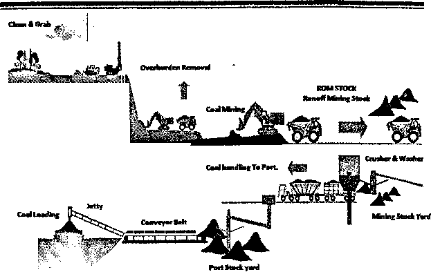
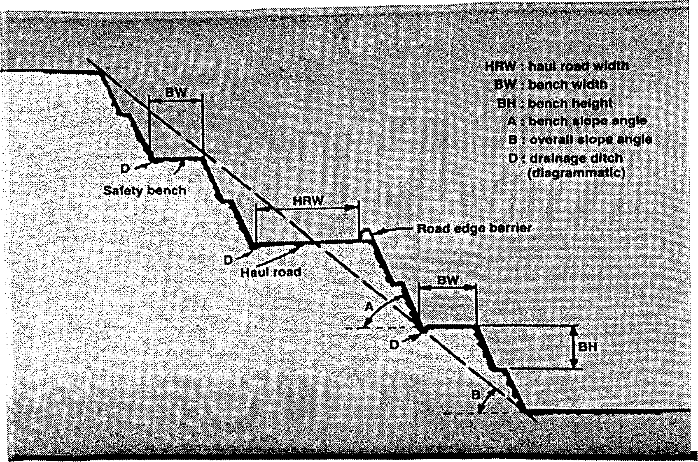
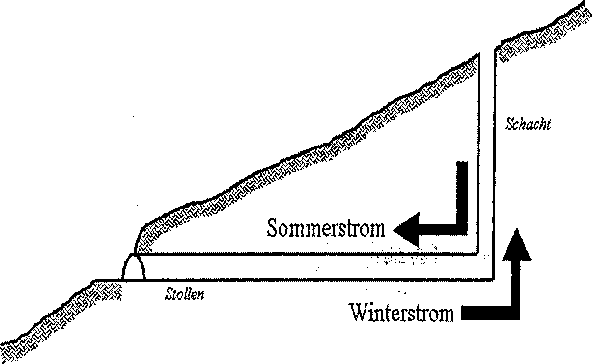
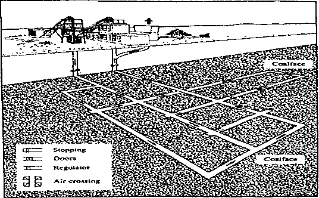
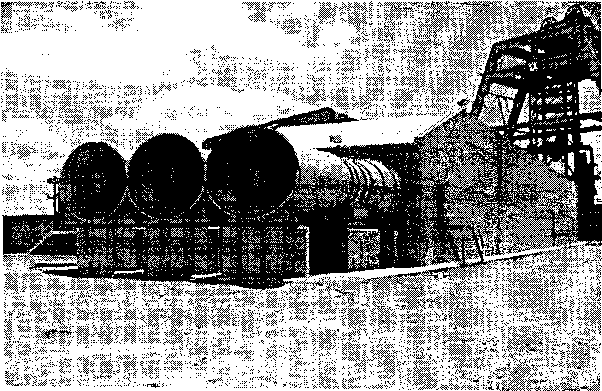

## 1. Giriş
Madencilik sektörü, doğası gereği içerdiği riskler nedeniyle özellik arz eden, bilgi, deneyim, uzmanlık ve sürekli denetim gerektiren en ağır ve tehlikeli iş kollarının başında yer almaktadır.
Gerekli önlemler alınmadığı taktirde ölüm ve yaralanma ile sonuçlanan kaza olasılığı her zaman vardır. Aynı zamanda çeşitli meslek hastalıkları çalışanların sağlığını tehdit etmektedir. Güvenli ve sağlıklı bir çalışma ortamı oluşturabilmek için Açık Ocak ve Yeraltı Madenciliği çalışmaları sırasında alınması gerekli önlemler aşağıda ana hatlarıyla belirtilmiştir. Değerlendirmelerde “Maden ve Taşocakları İşletmelerinde ve Tünel Yapımında Alınacak İşçi Sağlığı ve Işgüvenliği Önlemlerine İlişkin Tüzük” esas alınmıştır.

## 2. Açık Ocak (Yerüstü) Madenciliği
Açık ocak madencilik faaliyetleri sırasında yapılan çalışmalar aşağıdaki şekilde gruplandırılabilir: 
* Örtü tabakasının kazısı,
* Kömür, metalik cevher veya endüstriyel hammadde yatağının kazısı, 
* Kazılan malzemelerin yüklenmesi ve taşınması, 
* Taşınan malzemenin stok sahasında depolanması,
* Ocak sahasının madencilik faaliyetleri sonrası düzenlenmesi (Şekil 1)

### 2.1. Örtü Tabakası ve Maden Yatağının Kazısı
Örtü tabakası ve maden yatağının kazısı makine ve/veya patlayıcı madde kullanılarak yapılmaktadır.
#### a. Makine ile kazıda alınabilecek iş güvenliği önlemleri;
* Çalışma alanları, uygulanacak üretim tekniği ve güvenlik yönergeleri dikkate alınarak planlanmalıdır.
* Kazı yapılan ve lağım atılan kademe cepheleri, taşıma yolları, kitle ve blok kayması ve parça düşmesi olasılığı yönünden sürekli olarak denetlenmelidir.
* Basamak geometrisi (şevlerin eğimi ve yüksekliği, basamak genişliği) zeminin yapısına ve sağlamlığına ve uygulanan çalışma yöntemlerine uygun olmalıdır (Şekil 2,3,4).
* Makine operatörlerinin seçimi ve eğitimi konularına önem verilmelidir.
* Çalışmalar noktasal ve merkezi olarak devamlı denetlenmelidir. 
* Makinelerin periyodik bakım ve kontrolleri planlı bir şekilde yapılmalıdır.
* Ekonomik ömrünü tamamlayan makineler servisten alınmalıdır.
* Gece çalışmalarında yeterli düzeyde aydınlatma sağlanmalıdır.
* 

#### b. Patlayıcı Madde ile Kazıda alınabilecek iş güvenliği önlemleri;
* Bakanlığın izin verdiği türden patlayıcı maddeler kullanılmalıdır. 
* Grizulu, kömür tozlu ocaklarda, kükürt ocaklarında kullanılacak patlayıcı maddeler, bu ocaklarda kullanılabilecek nitelikte olmalıdır. 
* Patlayıcı maddelerin teslim alınması, taşınması, depolanması, dağıtılması, geri alınması vb. işler, bu amaçla eğitilmiş ve teknik	nezaretçi tarafından görevlendirilmiş kimseler tarafından, ilgili mevzuat hükümlerine göre	yapılmalıdır.
* Ateşleme işleri kesinlikle “Patlayıcı Madde Ateşleyici Yeterlik Belgesi” olan ateşleyici (barutçu) tarafından yapılmalıdır. 
* Ateşleyici, ateşleme tellerini manyetoya bağlamadan önce lağım atılacak yere gelen bütün yol ağızlarında önlem almalı, insanların	geçişine kapatılıp kapatılmadığını denetlemelidir.
* Ateşleme öncesi bütün bağlantılar gözden geçirilmeli, özel ölçme aletleri ile kısa devre kontrolü yapılmalıdır.
* Ateşleme öncesi çevreden açıkça anlaşılacak şekilde bir uyarı (siren çalınması vb.) yapılmalıdır.
* Atılacak lağımla savrulacak parçalara (kayaç. kömür, cevher) karşı korunmaya uygun sığınma yerleri hazırlanmalıdır (Şekil 5). 
* Lağım atıldıktan sonra ortamın duman ve gazlardan temizlenmesi için beklenmeli, bundan sonra ateşleyici ile yetkili kişiler tarafından yapılacak kontrollerde tehlike kalmadığı belirtilmedikçe bu yerlere girilmesine izin verilmemelidir.
* Ateşlemelerden ve donmaları izleyen arazi gevşemesi kar, yağmur vb. doğal olaylardan sonra, yeniden işe başlamalarda, kademe yüzleri ve çevresi bu işe ayrılmış deneyimli çalışanlar tarafından yukarıdan başlanıp aşağıya doğru sürdürülmek suretiyle çatlak sökümü yapılarak temizlenmelidir.
* Gece çalışmalarında yeterli düzeyde aydınlatma sağlanmalıdır. 

### 2.2. Kazılan Malzemelerin Yüklenmesi ve Taşınması
Kazılan malzemenin yüklenmesi ve taşınması genelde ekskavatör - kamyon sistemi ile gerçekleştirilmektedir.
**Bu çalışmalar sırasında alınacak iş güvenliği önlemleri;**
* Makinelerin çalışma koşulları, manevra yerleri, yükleme, taşıma ve boşaltma işlerinde uygulanacak güvenlik önlemleri belirlenmelidir. 
* İş makinesi (ekskavatör, loder, dozer vb.) operatörleri ile kamyon şoförlerinin seçimi ve eğitimine önem verilmelidir.
* İş makineleri ile kamyonların kapasite ve boyutları uyumlu olmalıdır. 
* Basamak geometrisi (eğim, yükseklik, genişlik) uygun seçilmelidir. 
* Kamyonla taşıma yapılacak yolların geometrik boyutları (eğim, genişlik, kurba çapları) uygun seçilmelidir. 
* Kademe düzlüğü, ateşlemelerden sonra bile, makinelerin güvenli bir şekilde manevra yapmalarına olanak verecek ve işçiler için tehlike oluşturmayacak genişlikte olmalıdır.
* Yol yüzeyleri her mevsimde taşımaya uygun durumda tutulmalıdır.
* Döküm sahası, kademe gibi iş makinelerinin düşme tehlikesi olan yerlerde yeterli yükseklikte güvenlik bariyerleri yapılmalıdır.
* Gece çalışması yapılan yerlerde optimum aydınlatma şartları sağlanmalıdır.

### 2.3. Taşınan Malzemenin Stok Sahasında Depolanması
Stok sahalarında alınacak iş güvenliği önlemleri;
* Stoklanan malzeme dış etkenlere (yağmur-kar, rüzgar vb.) karşı korunmalı ve stoğun duraylılığı sağlanmalıdır.
* Özellikle kömür stoklarında karşılaşılabilecek “Kendiliğinden Yanma” olaylarına karşı önlemler alınmalıdır. 
* Stoğa malzeme giriş ve çıkışı bir program çerçevesinde yapılmalıdır. 
* Stok sahası devamlı kontrol altında tutulmalı, ilgisiz kişilerin sahaya girişini önlemeye yönelik tedbirler (çit, duvar vb.) alınmalıdır. 
* Stok sahası geceleri yeterli düzeyde aydınlatılmalıdır (Şekil 14,15). 

## 3. Yeraltı Madenciliği
Yer altı madencilik çalışmaları sırasında yapılan işler aşağıdaki şekilde gruplandırılabilir: 
* Kazı 
* Tahkimat 
* Nakliyat 
* Havalandırma 
* Su atımı
* Diğer işler. 

### 3.1. Kazı
Üretimi yapılacak maden yatağına ulaşmak için, Büyük Hazırlıklar olarak isimlendirilen kuyu, galeri, desandri vb. boşlukların açılması gerekir. Daha sonra üretim amaçlı Damar İçi Hazırlıkların kazısı yapılır.
Kazı işlemi;
* Basit kazı araçları (El ile) (kazma - kürek, balyoz - keski, martopikör) (Şekil 17)
* Patlayıcı madde,
* Kazı makineleri ile gerçekleştirilir.

Günümüzde el ile kazı, ancak küçük işlerde, kazı makinelerinin giremeyeceği kadar dar olan yerlerde uygulanmaktadır.

**Patlayıcı Madde ile Kazıda alınacak güvenlik önlemleri;** 
* Bakanlığın İzin verdiği türden patlayıcı maddeler kullanılmalıdır. 
* Patlayıcı maddelerin teslim alınması, taşınması, depolanması, dağıtılması, geri alınması vb. işler, bu amaçla eğitilmiş ve teknik nezaretçi tarafından görevlendirilmiş kimseler tarafından, ilgili mevzuat hükümlerine göre yapılmalıdır. 
* Patlayıcı maddeler, depolanma ve kullanma yerinden başka yerlere götürülmemelidir.
* Donmuş veya bozulmuş patlayıcı maddeler, yeraltına sokulmamalı; yeraltı depolarında bozulanlar derhal imha edilmelidir.
* Ateşleme işleri kesinlikle “Patlayıcı Madde Ateşleyici Yeterlik Belgesi" olan ateşleyici tarafından yapılmalıdır. 
* Ateşleme işlemi öncesinde tüm personel tehlike sahası dışına çıkarılmalı ve ateşleme işlemi sonuçlanıncaya kadar sahaya girişler kesinlikle önlenmelidir.
* Ateşleyici, grizuiu ocaklarda^, lağım deliklerini doldurmadan önce, 25 m yarı çapındaki bir alan içinde ve özellikle tavandaki boşluklar ve çatlaklarda metan gazı ölçümü yapmalı; ölçmelerde % 1 metan tespit edilirse lağımları doldurmamalıdır (Şekil 18).
* Yapılan ölçümlerde havasında % 1 veya daha çok metan gazı bulunan kısımlarda patlayıcı madde kullanılamaz.   

**Makine ile (Mekanize) Kazıda alınacak güvenlik önlemleri;**
* Makine operatörleri dikkatle seçilmeli ve eğitilmelidir. 
* Makine bakım ve onarım işlerine gereken önem verilmelidir, 
* Metan gazı yayılımı olan ocaklarda "Alev Sızdırmaz AlSz” elektrikli cihazlar kullanılmalı ve bu özelliğini kaybetmiş olanlar derhal servisten alınmalıdır.
* Metan gazı yayılımı olan ocaklarda kazı makinesi keskilerinde sıcak yüzeylerin oluşması önlenmelidir (Şekil 19,20).
* Çalışanlar toz, gürültü, titreşim vb. olumsuz etkilerine karşı korunmalıdır. 

## 3.2. Tahkimat
Tahkimat, kazı çalışmaları sonucu açılan boşluğun duraylılığını sağlamak için ağaç, demir, beton vb. malzemeler kullanarak yapılan takviye işlemidir.
Tahkimat yapılmayan veya gerektiği şekilde tahkim edilmeyen ocak kesimlerinde;
* Taş düşmesi,
* Kaya bloklarının (dibek taşı, tabut taşı) düşmesi,
* Tahkimatın taşıyıcı özelliğini kaybetmesi (GÖÇÜK) sonucu iş kazaları meydana gelir. 

**Tahkimat kaynaklı iş kazalarını önleyebilmek için alınacak iş güvenliği önlemleri;**
* Tahkimat türü ve kullanılacak malzeme özellikleri ortam şartları (Gerilme durumu, kayaç - cevher yapısı, boyutlar, açıklığın ömrü vb.) dikkate alınarak belirlenmelidir (Şekil 21,22,23,24).
* Yeterli miktar ve özelliklerde tahkimat malzemesi, gerektiğinde yararlanılabilecek şekilde sürekli olarak hazır bulundurulmalıdır.
* Tahkimat işinde çalışacak ekipler teorik ve pratik eğitimden geçirilmeli, hizmet içi eğitim sürdürülmelidir.
* Tahkimat yapımı öncesi hazırlık ve tahkimat yapım çalışmaları sürekli olarak denetlenmelidir. Nezaretçiler ve ilgili işçiler sık sık ve özellikle duraklamalar sonrası işe başlamalarda çalışılan yerin tavanını ve tahkimatını kontrol etmelidir.
* Eğimli damarlarda bağlar, orta direkler ve domuzdamları tabakaların olası kayma vb. hareketlerini önleyecek şekilde yapılmalıdır.
* Taşıyıcı özelliğini kaybeden veya eskiyen tahkimat üniteleri yenilenmelidir. 

## 4. Nakliyat
Yer altı madenciliğinde kazılan cevher ve/veya kayaç yatay ve düşey yönde kurulan nakliyat sistemleri vasıtasıyla yeryüzüne ulaştırılır. Ayrıca karşıt yönde, üretim faaliyetleri sırasında kullanılacak malzemenin taşınması söz konusudur. Cevher ve malzeme naklinin yanı sıra çalışanlar da yerüstünden yeraltına ve yeraltından yerüstüne taşınırlar.
Nakliyat çalışmaları sırasında; 
* Araçlarının çarpışması, devrilmesi, 
* Çarpma ve sıkıştırmalar, 
* Halat kopmaları,
* Sürtünme kaynaklı yangınlar, egzoz gazlarının neden olduğu patlamalar,
* Elektrik çarpmaları vb. iş kazaları meydana gelmektedir.

**Nakliyat kaynaklı iş kazalarını önleyebilmek için;**
* Yer altı boşlukları nakliyat gereksinimleri de dikkate alınarak boyutlandırılmalı (Şekil 25, 26).
* Araçlar kapasitelerine uygun şekilde yüklenmeli,
* Yükleme-boşaltma noktalarında ve nakliyat yapılan yollarda yeterli aydınlatma sağlanmalı,
* Nakliyat işinde çalışacak personel teorik ve pratik eğitimden geçirilmeli, hizmet içi eğitim sürdürülmeli,
* Metan gazı yayılımı olan ocaklarda “Alev Sızdırmaz (AlSz)” özellikte elektrikli nakliye araçları kullanılmalı ve bu özelliğini kaybetmiş olanlar servisten alınmalı,
* Nakliye araçlarının bakım ve onarımları gerektiği şekilde yapılmalı, ekonomik ömrünü dolduran araçlar servisten alınmalıdır.
* Önemli taşıma işi yapılan yollar, garajlar, rösetler, makaslar, yol kavşakları, vb. badana yapılmalı ve yeterince aydınlatılmalıdır.
* Taşıma yolları temiz tutulmalı, yol üzerinde gidiş gelişi zorlaştıracak engeller (kömür, cevher parçaları, tahkimat malzemesi vb.) bulunmamalıdır.
* Mekanik manevra ve özel taşıma dışında demiryollarında eğim % 0,5'i geçmemelidir. 

## 5. Havalandırma
Havalandırma; çalışanlara temiz hava sağlamak, açığa çıkan ve/veya oluşan gaz veya tozları seyreltmek, ocak dışına taşımak ve ocak iklimini düzenlemek amacıyla yapılan çalışmalardır. Havalandırma ile ilgili hususların ocağın planlanması aşamasında göz önünde bulundurulması gerekir.

**Yetersiz havalandırma nedeniyle ortaya çıkabilecek boğulma, zehirlenme, gaz ve toz patlaması olaylarını önlemek için;** 
* Basit ve kolay izlenebilir bir havalandırma şebekesi oluşturulmalı, 
* Ocağa yeterli miktarda temiz hava verilmeli, 
* Havanın ocak içinde planlanan şekilde dağılması sağlanmalı,
* Kömür ocakları mutlaka mekanik olarak havalandırılmak, difüzyon yoluyla havalandırmaya izin verilmemeli (Şekil 27,28,29). 
* Ocağı havalandıran ana vantilatörlerin yedeği olmalı ve enerji kesintileri sırasında otomatik olarak devreye girecek bir jeneratör bulundurulmalıdır,
* Eşdeğer ocak açıklığı 2 m2’den büyük olmalıdır.
* Bütün ocak için "emici", tali havalandırmada "üfleyici”, uzun ve meyilli lağımlarda "karışık (emici + üfleyici)" sistem uygulanmalıdır.
* Düzenli olarak yapılacak ölçümlerle, (sıcaklık, nem, hava hızı, gaz ve toz miktarları vb.) ocak havası devamlı olarak denetlenmen, gerek duyulması halinde merkezi gaz izleme sistemi kurulmalıdır.
* Metan gazı yayılımı olan ocaklarda kullanılan elektrik donanımı alev sızdırmaz özellikte olmalı, tehlike oluşturmayacak patlayıcı maddeler kullanılmalıdır.
* Metan gazı yayılımı olan ve yangına eğilimli kömür damarlarının bulunduğu ocaklarda çalışan tüm işçilere bireysel karbonmonoksit maskesi verilmelidir.

## 6. Su Atımı
Madencilik çalışmaları genellikle su içeren tabakalar içinde veya bu tabakaların altında yürütülür, özellikle deniz, göl vb. büyük su çanaklarının altında sürdürülen hazırlık ve üretim çalışmaları sırasında sorun çok daha büyük önem taşımaktadır.
**İş Sağlığı ve Güvenliği açısından karşılaşılan sorunlar:** 
* Su baskınları,
* Asidik sular şeklinde özetlenebilir. 

**Ocaklarda su baskınları veya asidik sulara karşı alınacak önlemler;**
* Ocak ağızları, dışarıdan gelecek su baskınlarının etkisinden zarar görmeyecek yerlerde seçilmeli,
* Su geliri yüksek olan zonlar kontrol sondajları ile izlenmeli,
* Su baskını tehlikesine karşı önlemler (drenaj, barajlama) alınmalı, personel bu konuda eğitilmeli,
* Su havuzlarının hacmi ve pompa tesisinin kapasitesi su gelirindeki aşırı yükselmeler ve ortaya çıkabilecek arızalar dikkate alınarak belirlenmeli,
* Asidik su geliri ve suyun bileşimi incelenmeli, bu tür sular çalışanlar ve çevre açısından bir sorun yaratmayacak şekilde depolanmalı ve ocaktan uzaklaştırılmalıdır.

## 7. Enerji Kullanımı
Madencilikte kullanılan başlıca enerji türleri: Basınçlı Hava, Kimyasal ve Elektrik Enerjisi’dir.
Enerji kullanımı sırasında; patlamalar, ocak yangınları, kısa devre ve elektrik arkları, elektrik çarpması vb. olaylar meydana gelmektedir.

**Eneği kullanımı sırasında alınacak iş güvenliği önlemleri;**
* Basınçlı hava şebekesi ve şebekede kullanılan armatürler tekniğine uygun şekilde planlanmalı, kontrol altında tutulmalıdır.
* Mazot vb. yanıcı maddelerin ocak içinde taşınması ve depolanması sırasında gerekli önlemler alınmalı, depolama yerleri kontrol altında bulundurmalıdır.
* Ortaya çıkabilecek yangın veya patlama tehlikesine karşı sınırlandırma ve söndürme önlemleri alınmalıdır.
* Yetkisiz kimselerin elektrik donanımını kullanması ve tamiri yasaklanmalı, elektrik çarpması durumunda yapılacak işler bir yönerge ile belirlenmelidir.
* Bütün elektrikli aygıtlar, iletkenler ve elektrik hatları ilgili mevzuata ve standartlara uygun olmalıdır.
* Elektrik kaçağı yapabilecek elektrikli aygıtlar ve madeni kısımlar, topraklamayla güvenlik altına alınmalıdır.
* Ocak dışında bütün ocağın elektrik akımını kesmeye yarayan bir ana devre kesici bulunmalıdır. 

## 8. Malzeme Kullanımı
Maden ocaklarında ağaçtan demire, patlayıcı maddelerden mazota kadar çok çeşitli malzemeler kullanılmaktadır. Sağlıklı ve güvenli bir çalışma ortamı oluşturabilmek için bu malzemelerin seçimi ve kullanılması sırasında yeterli özenin' gösterilmesi gerekir.
* Malzemeler kullanım alanları dikkate alınarak seçilmeli, kontrol sonucu gerekli özellikleri taşımadığı ve hatalı olduğu anlaşılanlar ocağa sokulmamalıdır.
* Yangına karşı kullanılmak üzere bulundurulan malzemeler, ayda en#az bir kez, sorumlu nezaretçiler tarafından denetlenmelidir. 
* Alev sızdırmaz veya kendiliğinden emniyetli aygıt ve malzemeler, bu niteliklerini yitirip yitirmedikleri yönünden 5 yılda en az bir kez test istasyonlarında muayene edilmeli, bu niteliklerini yitirdiklerinde kullanılmamalıdır.
* Devamlı olarak kullanılan malzemeler ocağın belli yerlerinde oluşturulan malzeme ambarlarında hazır bulundurulmalıdır. 
