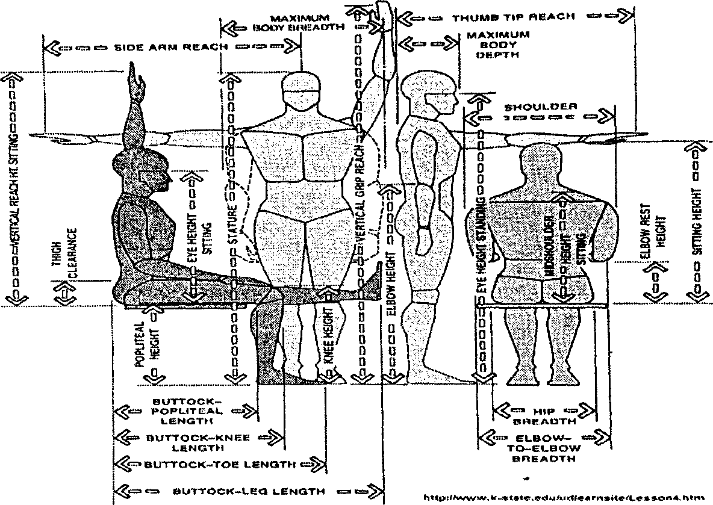

## 1. Genel Bilgiler
Ergonomi, Yunanca bir kelime olup, “Ergon = İş, Çalışma” ve "Nomos = Yasa” kelimelerinden oluşmaktadır.
İnsan, Makine ve Malzemeden oluşan üretim sistemlerinde optimum çalışma koşullarının sağlanması konusunda büyük katkılar sağlayan Ergonomi; Tıp Bilimleri (Anatomi, Fizyoloji), Davranış Bilimleri (Psikoloji, Sosyoloji, Antropoloji), Mühendislik Bilimleri ve Yönetim Bilimleri’nden yararlanmaktadır. Ancak bu yararlanma sırasında kendine özgü yöntemleri ve araştırma yollarını kullanarak genel yasalara ulaşmaya çalışır. 
Doğruluğu bilimsel olarak kanıtlanmamış, ergonomik ilkelere dayanmayan veya onları gereken önemde göz önünde bulundurmayan hiç bir sistem tasarımının başarılı olamayacağını belirtmek gerekir.
Özellikle; Metot Etüdü ve İş Ölçümü, İş Basitleştirme, İşlem ve İş Analizi, İş Standartlaştırması, Metot Araştırması, Üretim Hatlarının Dengelenmesi vb. çalışmaların tümünde temel öge olarak Ergonominin bulunması gerekir.
Aksi taktirde, tasarımı yapılan sistem kısa bir süre için başarılı gibi görünse de uzun dönemde başarısız olmaya mahkumdur.

## 2. Ergonomi Tanımları
* Ergonomi, insan ile kendi çalışma çevresi arasındaki ilişkinin bilimsel etüdüdür (Erkan, 1976).
* Ergonomi, insan, teknik ve çevre uyumunun temel kurallarını ortaya koyan çok disiplinli bir bilim dalıdır (Dinçer, 1978).
* Ergonomi, çalışmanın metotlu bir şekilde düzenlenmesi ve makineler ile donanımın, çalışan insanların yatkınlıklarına göre hesaplanması amacıyla yapılan inceleme ve araştırmaların tümüdür (Toka, 1978). 
* Ergonomi, çalışanların biyolojik ve psikolojik özelliklerini ve kapasitelerini göz önünde bulundurarak, insan - makine - çevre uyumunun doğal ve teknolojik yasalarını ortaya koyan çok disiplinli bilim dalıdır.
* Ergonomi, insanların anatomik özelliklerini, antropometrik karakteristiklerini, fizyolojik kapasite ve toleranslarını göz önünde tutarak, endüstriyel iş ortamındaki tüm faktörlerin etkisi ile oluşabilecek, organik ve psikososyal stresler karşısında sistem verimliliği ve insan - makine - çevre uyumunun temel yasalarını ortaya koymaya çalışan çok disiplinli bir araştırma ve geliştirme alanıdır. 

## 3. Tarihçe
Ergonominin tarihçesi ile ilgili yapıtlarda öncelikle Frederick W. Taylor'dan bahsedilmektedir. Bir makine mühendisi olan Taylor, 18. Yüzyılın ikinci yarısında “İş Düzeni" anlayışını geliştiren ve çalışanların daha verimli olabilmesi için teoriler üreten bir araştırıcıdır.
1910'larda ergonomik çalışmalara destek sağlayacak iki yeni yöntem geliştirilmiştir. Bunlar mühendis Frank B. Gilbreth ve psikolog eşi Lillian M. Gilbreth'in geliştirdikleri “İş Zaman Etüdü" ve Duglas'ın geliştirdiği “Oksijen Tüketimi Bağıntısıdır. Ergonomi bilim alanı konusundaki ilk adımlar Uygulamalı Psikoloji uzmanlarınca atılmıştır. 
Birinci Dünya savaşı sonunda İngiltere’de “Endüstriyel Yorgunluk Araştırma Kurulu” oluşturulmuştur. Çalışma şartlarının insan performansı üzerindeki etkileri, iş veriminde sosyal ilişkilerin önemi vb. konularda araştırmalar yapılmıştır.
Özellikle İkinci Dünya Savaşı sırasında kazanılan deneyimler, geliştirilecek her türlü makinenin tasarımında insan faktörünün göz önüne alınmasının gerekliliğini ortaya koymuştur. Konuyla ilgili araştırmalarda bulunmak üzere İngiltere’de “Oxford Medical Research Unit” ile Cambridge Applied Psychology Unit" ABD'de” Dayton Aeromedical Laboratory Psychology Branch” kurulmuştur. 

Değişik bilim alanlarındaki araştırmacılar arasındaki kopukluklar nedeniyle ortaya çıkan olumsuzluklar, farklı bilim ~ dallarından araştırmacıların bir araya getirilmesi düşüncesini doğurmuştur. Bu amaçla İngiltere’de kurulan "Ergonomi Araştırma Konseyi (Ergonomics Research Counsil)” anatomi, fizyoloji, psikoloji, tıp ve mühendislik bilimleri dallarından çok sayıda uzmanı bir araya getirmiştir.
Bu alanda yürütülen çalışmaların “Ergonomi” olarak isimlendirilmesi de 1949 yılında toplanan bu konsey tarafından kararlaştırılmıştır. Konsey çalışmaları yoğun ilgi görmüş ve 1964 yılında “Uluslararası Ergonomi Derneği ( The Ergonomics Society)"nin kuruluşuna temel oluşturmuştur.

Yurdumuzda Ergonomi, 1969 yılında İstanbul Teknik Üniversitesi'nde “Işbilim” ders konuları içinde okutulmaya başlanmış ve dersin uygulamalı çalışmalarında endüstride antropometrik araştırmalara önem verilmiştir.
Ergonomi dersleri, Ortadoğu Teknik Üniversitesi, Endüstri Mühendisliği Bölümü'nde 1971 yılından itibaren "Human Factor Engineering" adı altında okutulmaya başlanmıştır. Bölümde, yurtdışından getirilen cihazlarla 1975 yılında bir laboratuvar kurulmuştur.
Dokuz Eylül Üniversitesi, Endüstri Mühendisliği Bölümü’nde, 1980’li yıllarda, yurt dışından getirilen gelişmiş laboratuvar cihazlarıyla desteklenen bir Ergonomi laboratuvarı kurulmuştur. Ayrıca Federal Almanya Kültür Ateşeliği ile ortaklaşa 1. ve 2. Türk - Alman Ergonomi Sempozyumları düzenlenmiştir. 

## 4. Ergonominin Temel Kavramları
1. Yüklenme ve Zorlanma
2. Fiziksel ve Zihinsel Çalışma
3. Yorgunluk
4. Çevre Koşulları
5. Antropometri
6. Sosyal ve Psikolojik Uyum 

### 4.1. Yüklenme ve Zorlanma
İşin niteliğinden, akışından ve çevre koşullarından doğan ve yaptığı iş sırasında insandan beklenilen görevler Yüklenme olarak isimlendirilir.
Bu kavram sadece işin özelliklerine bağlıdır ve işi yapan kişiden bağımsızdır. Diğer bir deyimle, tanımlanan bir işi yapan herkesin o iş ile ilgili yüklenmesi aynıdır, örneğin, bir ağırlığın belli bir uzaklığa taşınması işi ile ilgili yüklenme herkes için aynıdır.
Yüklenmenin kişi üzerindeki etkisi onun farklı özelliklerine ve niteliklerine bağlıdır. Dolayısıyla yüklenmenin etkisi kişiden kişiye değişir. Aynı yüklenmenin farklı kişiler üzerinde oluşturduğu bu farklı etkiler Zorlanma olarak tanımlanır, örneğin bir ağırlığın taşınması sırasında bir çocuğun, kadının veya yetişkin erkeğin zorlanmaları farklıdır.

### 4.2. Fiziksel ve Zihinsel Çalışma
Yapılan işler iş yükünün ağırlığı açısından Fiziksel ve Zihinsel İşler olarak iki grupta incelenebilir.
Fiziksel İşler kassal ağırlıklı işler olup, insan vücudunun daha çok iskelet - kas, solunum ve dolaşım sistemlerini etkiler.
Zihinsel İşler ise düşünme ve dikkat gerektiren, bilgi üretme ve işleme fonksiyonlarına yönelik işlerdir. Dolayısıyla merkezi sinir sistemi ve algı organlarının yüklenmesine neden olur.
Ayrıca Fiziksel İşler, iş yükünün derecesine göre;
* Statik Kassal Çalışma,
* Dinamik Kassal Çalışma (Şekil 2). 

### 4.3. Yorgunluk
Çalışma veya değişik nedenlerle bireyin ruh ve beden etkinlikleri açısından verimlilik düzeyinin düşmesidir. Ergonometrik yaklaşımlarda Fizyolojik ve Psikolojik Yorgunluk olmak üzere iki farklı yorgunluk türünden bahsedilir.
Fizyolojik Yorgunluk, kaslarda enerji metabolizmasının yavaşlaması ve yorgunluk kalıntılarının (karbondioksit ve laktik asit) kas hücreleri içinde birikmesi sonucu meydana gelir. Kas çalışması maksimum performans kapasitesinin altında bir iş yükü ile yapılıyorsa ve her çalışma dönemi ardından dinlenme molaları veriliyorsa yorgunluk gecikir ya da hiç oluşmaz 
Psikolojik Yorgunluk, fizyolojik yorgunluğun dışında iş verimini etkileyen önemli bir etkendir. Bezginlik ve bitkinlik şeklinde de tanımlanabilen bu tür yorgunluk, farklı düzeylerde olabileceği gibi kişilerin ruhsal durumlarına göre de farklı özellikler gösterir.
Genelde psikolojik yorgunluk, fizyolojik yorgunluk gibi fark edilemez. Aşırı duyarlılık, içe dönük davranışlar, hatalara karşı aşırı duyarlılık ve reaksiyon, erken acıkma, iş çevresinden şikayetlerin artması, gereksiz yakınmalar ve genel bir mutsuzluk hali psikolojik yorgunluğun belirtileri olabilir. 

Yorgunluğu oluşturan nedenler çok çeşitli olup bunlar arasında en önemlileri aşağıda sıralanmıştır.
* Yapılan bedensel ya da zihinsel işin yoğunluk ve süresi,
* Çevre koşulları,
* Sorumluluk, üzüntü ve çatışma,
* Vücut direncini zayıflatan hastalıklar, ağrılar,
* Yetersiz veya hatalı beslenme,
* Yapılan işin tekdüze (monoton) olması,
* Gereksinme duyulan ile istihdam edilen işçi sayıları arasındaki dengesizlik,
* İşçi alma, işe özendirme ve çalışanları değerlendirme tekniklerindeki hatalar

Çalışanların fizyolojik kapasiteleri farklı olduğu gibi, psikolojik özellikleri de çok değişiktir. Bu nedenle aynı işi yapmakta olan iki çalışandan birinde aşırı fiziksel yorgunluk belirtileri ya da psikolojik yakınmalar ortaya çıkarken, diğerinin rahat ve şikayetsiz bir şekilde işini sürdürdüğü çok sık gözlenir.

### 4.4. Çevre Koşulları
Bir insan - makine sisteminde çalışanları etkileyen işyeri ortamı ile ilgili faktörleri (çevre koşulları) dört başlık altında toplamak mümkündür.
* Kimyasal Faktörler, 
* Fiziksel Faktörler,
* Biyolojik Faktörler,
* Sosyal ve Psikolojik Faktörler.

İnsanın çalışma sırasında kendisini fizyolojik ve psikolojik açıdan rahat hissedebilmesi için söz konusu büyüklüklerin araştırmalar sonucu belirlenen aralıklarda olması gerekmektedir.

### 4.5. Antropometri
Yunanca anthropo (insan) ve metrikos (ölçme) sözcüklerinden türetilen antropometri, insan vücudunun boyutları ile ilgilenen özel bir bilim dalıdır. Çalışanların fiziksel rahatlıkları ve bedensel yeteneklerini en üst düzeye çıkarabilmeleri için, kullandıkları her türlü araç ve gerecin onların ölçülerine ve biyomekanik özelliklerine uygun olarak tasarımlandırılmasına yönelik tekniklerdir.
Bu ölçüler belirlenmeden İnsan ile Makine aras'ında' uyum sağlamak mümkün olmadığı gibi, rasyonel, yorucu olmayan ve güvenli bir iş ortamı da oluşturulamaz. Çünkü, bir makine teknik yönden ne kadar kusursuz olursa olsun, eğer onu kullanacak insanın ölçülerine ve biyomekanik özelliklerine uygun değilse etkin bir şekilde kullanılamaz. 

### 4.6. Sosyal ve Psikolojik Uyum
Günümüzde bilimsel ve teknolojik gelişme ve değişimler sonucu, iş yaşamındaki makineleşme oranı hızla artmakta, insanların görev sınırları gittikçe daralmaktadır.
İnsanlar, otomasyon, seri üretim, robotların kullanılması vb. teknolojik gelişmeler nedeni ile, üretimde bir değeri olan, vazgeçilmez, yaratıcı kişiler olmaktan uzaklaşmaya başlamışlardır. Gittikçe daha karmaşık hale gelen sistemler insanların önem ve sorumluluğunu arttırmaktadır.
işçilerin verimliliği ve başarısı, onların sosyal entegrasyonu ile yakından ilgilidir. İnsanlar kendilerine önem verildiğini, güvenliklerinin sağlandığını ve çalıştıkları iş yerinde bir yer ve kişilik kazandıklarını hissederlerse, işyerindeki koşullar ne kadar olumsuz ve iş yükü ne derece ağır olursa olsun kendilerini fizik ve moral açıdan sağlıklı hissederek yüksek verimle çalışmaktadır. 

## 5. Ergonominin Hedefleri

### a. İnsancıllık ve Ekonomiklik
İnsani ve ekonomik amaçları göz önünde bulundurarak insana ait özelliklerin, bilgilerin, yeteneklerin bilinmesi ve bunlara ait alt ve üst sınırların belirlenmesi, insana yaraşır bir iş düzenlemesinin sağlanmasıdır.
#### b. Sağlığın Korunması
Sağlığın korunması, geniş anlamda çalışma koşullarından ileri gelen iş kazaları ve meslek hastalıkların önlenmesi ve/veya azaltılmasını sağlamaktır. 
#### c. Sosyal Uygunluk
işin sosyal açıdan insana uygunluğu, insanın toplumsal yaşamda üstleneceği roller için önem arz eder. İnsanın yaşamını toplumsal yapı içinde sürdürebileceği ortamın sağlanması ve bireyler arası ilişkilerin özendirilmesini sağlamaktır.
#### d. Teknik - Ekonomik Rasyonellik
Insan-makine sisteminin fonksiyonel açıdan doğru biçimde düzenlenmesi, bu tür sistemlerin performans yeteneklerinin sürekliliğinin sağlanması ve insanların sistem içinde ekonomik açıdan en doğru biçimde görevlendirilmesini sağlamaktır. 

## 6. Ergonomik İş Düzenleme
İş Düzenlemesi yapılırken öncelikle işin “insana Uygun, İnsancıl" olması göz önünde bulundurulmalıdır. Günümüzde işin insancıllaştırılması kavramı genel anlamda, insanın yalnızca bedensel değil; zihinsel, psikolojik ve sosyal gereksinimlerini de dikkate alarak çalışma koşullarının iyileştirilmesini ifade etmektedir.
Bir mal veya hizmetin üretiminden pazarlamasına kadar geçen süreçteki her aşamanın organizasyonu iş düzenlemenin uğraşı alanları içindedir.
İş düzenleme genelde ek yatırımlar gerektirir. Ancak bu çalışmalar sonrası oluşturulan insana uygun iş, üretim ve kalitenin artmasını sağlar. Böylece, bir taraftan verimlilik artarken diğer taraftan zorlanma ve iş yorgunluğu da azaltılmış olur. 

### 6.1. İş Düzenlemede Dikkate Alınacak Kriterler
İnsanlar yaş, cinsiyet, ırk, eğitim, yetenek, duyarlılık, yaratıcılık, becerileri vb. ile farklılıklar göstermektedir. Bu nedenle, tüm çalışanlar için geçerli bir iş düzenleme kavramı sadece kuramsal olarak geçerlidir.
W. Rohmert’e göre insana uygun olarak düzenlenmiş bir işin, birbirini hiyerarşik olarak izleyen aşağıdaki dört ilkeye uyması beklenir:
* Yapılabilirlik,
* Dayanabilirlik,
* Beklenebilirlik,
* Hoşnutluk.

#### a. Yapılabilirlik
Bir iş insanın biyolojik yapısı dikkate alınarak ve yaşamını tehlikeye sokacak tehditler içermeyecek şekilde düzenlenmiş ise “Yapılabilir iş” olarak değerlendirilir.
#### b. Dayanılabilirlik
İnsan organizması çevre koşullarına uyum sağlamak için iki özelliğe sahiptir. 
* Kısa sürede yüksek performans gösterebilme yeteneği,
* Sürekli performans yeteneği.

SPS, REFA’nın tanımına göre; “Ortalama, sağlıklı bir kimsenin uzun süre boyunca, kendisine ek bir dinlenme zamanı verilmeksizin sürdürebileceği maksimum performanstır”. Bir iş, belirli koşullar için iş bilimsel verilere göre saptanmış olan sürekli performans sınırına uyarsa o iş “Dayanılabilir" olarak kabul edilir.

#### c. Beklenebilirlik
Beklenebilirlik, dayanabildik sınırları içindeki koşulların gruplar tarafından kabulü demektir. Bir iş, belirlenmiş olan toplumsal, teknik ve organizasyona ait çevre koşulları altında çalışanların çoğunluğu tarafından katlanılabilir olarak değerlendiriliyorsa “Beklenebilirlik” koşulu sağlanmıştır.

#### d. Hoşnutluk
İşten hoşnutluk, kişinin özelliklerine, işe alışma düzeyine ve bunların iş hayatına etkilerine bağlıdır. Hoşnutluk psikolojik bir sorun olarak ele alınır ve bireyseldir. Yapılan anketler ile belirlenebilir. Anket sonuçlarına göre iş yerinde yeniden iş düzenleme ya da işe uyumlandırma çalışmaları yapılabilir. 

### 6.2. Ergonomik Açıdan İşyeri Düzenleme
#### a. Antropometrik İşyeri Düzenleme
Çalışanın gereksiz zorlanmasını önlemek, büyük kas gruplarının tek yanlı kullanılmasını sınırlandırmak için; kullanılan araç-gereç, çalışma yüzeyi ve hareket alanlarını çalışanın antropometrik ölçülerini dikkate alınarak boyutlandırmak. 
#### b. Fizyolojik Açıdan İşyeri Düzenleme
iş gücünün verimliliğini artırmak için sürekli zorlanmayı önlemek, statik kassal çalışmayı azaltmak, çevre koşullarını (iklim, gürültü, aydınlatma, mekanik titreşimler vb.) tolere edilebilir düzeye çekmek vb. 
#### c. Psikolojik Açıdan İşyeri Düzenleme
Çalışma ortamdaki monotonluğu (tekdüzelik) ortadan kaldırmaya yönelik önlemler alarak, çalışanın motivasyonunu artırmak.
#### d. Enformasyon Tekniği ile İlgili Düzenlemeler
Çalışanın görme, işitme ve dokunma yoluyla aldığı enformasyonları artırmak amacıyla önlemler almak.
#### e. İş Organizasyonu İle İlgili Düzenlemeler
Çalışma/dinlenme oranlarını düzenlemek, iş rotasyonu, gece çalışma sürelerini azaltmak vb. önlemler almak.
#### f. İş Güvenliği İle İlgili Düzenlemeler
Çalışanları iş kazalarından korunmaya ve meslek hastalıklarını önlemeye yönelik bütün konstrüktif ve pratik tasarım ilkelerinin göz önüne alındığı teknik önlemleri içerir. 
