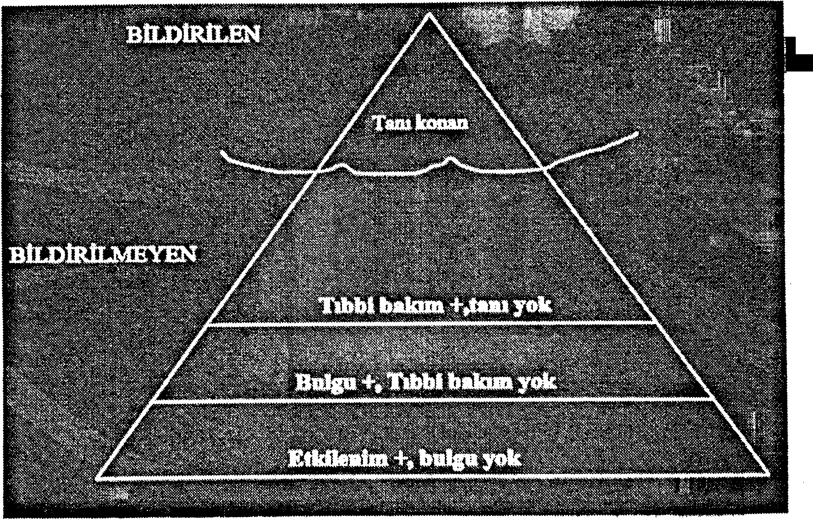

## 1. Tanım
Meslek hastalıkları, işyeri ortamında bulunan faktörlerin etkisi ile meydana gelen hastalıkların ortak adıdır. Dünya Sağlık Örgütü ve Uluslararası Çalışma Örgütü gibi uluslararası kaynaklarda meslek hastalıkları; zararlı bir etkenle bundan etkilenen insan vücudu arasında, çalışılan işe özgü bir neden-sonuç, etki-tepki ilişkisinin ortaya konabildiği hastalıklar grubu olarak tanımlanmaktadır. Meslek Hastalığı, 5510 sayılı Sosyal Sigortalar ve Genel Sağlık Sigortası Kanunu'nun (Kabul: 31.05.2006, RG: 16.16.2006) 14. Maddesi'nde şu şekilde tanımlanmıştır.

**Meslek Hastalığı;** sigortalının çalıştığı veya yaptığı işin niteliğinden dolayı tekrarlanan bir sebeple veya işin yürütüm şartları yüzünden uğradığı geçici veya sürekli hastalık, bedensel veya ruhsal özürlülük halleridir.

## 2. İstatistiksel Veriler
SGK istatistiklerine göre, 2012 yılında Türkiye'de 395 Meslek Hastalığı belirlenmiştir. Meslek Hastalığı nedeniyle 1 çalışan hayatını kaybetmiş ve 173 çalışan sürekli çalışmaz duruma gelmiştir. Bu değerler gerçeği yansıtmamaktadır. Ülkeler arasında farklılıklar bulunmakla birlikte, yıl bazında çalışan her bin kişi için 4-12 meslek hastalığı olgusu beklenmektedir. SGK istatistiklerine göre; 2012 yılı Aralık ayı itibarıyla 4a kapsamındaki toplam sigortalı sayısı 11.939.620'dir. Bu değerlendirmeler ışığında meslek hastalığı sayısının 47.758 - 143.275 arasında olması gerekmektedir. 

Dünyada iş kazaları oranı %44, meslek hastalıkları oranı %56 iken, Türkiye'de iş kazaları oranının yaklaşık %99, meslek hastalıklarının %1 olması çok açık bir çelişki oluşturmaktadır. Dünyada her yıl 160 milyon kişi meslek hastalıklarına yakalanıyor iken Türkiye'de sayının, 2010 yılında 533, 2011 yılında 697 ve 2012 yılında 395 olması; yine dünyada her yıl 1 milyon 700 bin kişi meslek hastalıklarından dolayı yaşamını kaybederken Türkiye'de ölüm sayısının 2010'da 10, 2011'de 10 ve 2012 yılında da 1 olması anlaşılır gibi değildir. 

Dünyada mesleki ve iş ile ilgili hastalıklar arasında ilk sırayı fiziksel etkenlerle oluşan hastalıklar (%40 ile kas-iskelet sistemi hastalıkları) almaktadır. Türkiye'de ise meslek hastalıklarının 246'sı (%62,2) silikoz, 78'i (%19,7) kimyasalların neden olduğu hastalıklardır. Sadece 2 işitme kaybı belirlenmiştir. Meslek hastalıkları sıralamasında Zonguldak (221 olay), Ankara (61 olay), İstanbul (21 olay) ile ilk üç sırayı almaktadır.

## 3. Sınıflandırma
Ülkemizde de liste sistemi uygulanmaktadır. Sosyal Sigortalar Kurumu (SSK) 1979 yılında Avrupa Ekonomik Topluluğu (AET) Meslek
Hastalıkları Listesi'ni önemli ölçüde revize ederek Türkiye Meslek Hastalıkları Listesi'ni oluşturmuştur. Hazırlanan listede meslek hastalıkları 5 ayrı bölümde sınıflandırılmıştır. Bu sınıflara giren hastalıkların ayrıca alt grupları bulunmaktadır.

**A Grubu:** Kimyasal maddelerle olan meslek hastalıkları (Bu grupta 25 grup kimyasal maddeye bağlı 67 hastalık bulunur.)

**B Grubu:** Mesleki deri hastalıkları (Bu grupta deri kanseri ve kanser dışı deri hastalıkları olmak üzere 2 hastalık vardır.)

**C Grubu:** Pnömokonyozlar ve diğer mesleki solunum sistemi hastalıkları (Bu grupta 6 tür etkene bağlı toplam 9 hastalık bulunmaktadır.)

**D Grubu:** Mesleki bulaşıcı hastalıklar ( Bu grupta dört tür etkene bağlı toplam 30 hastalık yer almaktadır.)

**E Grubu:** Fiziki etkenlerle olan meslek hastalıkları ( Bu grupta 7 grup fiziksel etkene bağlı toplam 12 hastalık vardır.) 

## 4. Yükümlülük Süresi ve Maruziyet Süresi
Listede her hastalık için başlıca belirtiler ve hastalık tehlikesi bulunan başlıca iş türleri sıralanmıştır. Ayrıca her hastalık için "Yükümlülük Süresi" ve "Maruziyet Süresi" belirlenmiştir.

**Yükümlülük Süresi:** Zararlı mesleki etkinin sona ermesi ile hastalığın ortaya çıkması arasında geçebilecek en uzun süredir.

Bazı hastalıklar için bu sürenin belirlenmesi oldukça zordur. Bu nedenle bazı ülkelerde bu süre kaldırılmıştır. Ülkemizde ise çalışanların zarar görmemesi için oldukça uzun tutulmuştur. Kurşun zehirlenmesinde yükümlülük süresi 3 yıldır. Yükümlülük süresi aşılmış olsa bile, söz konusu hastalık, Sosyal Sigorta Yüksek Sağlık Kurulunun onayı ile meslek hastalığı sayılabilir. 

**Maruziyet Süresi:** Zararlı etkinin başlamasıyla hastalık belirtilerinin ortaya çıkması arasında geçen en az süredir. Birçok ülkede verilmemiştir. Türkiye'de iki durum için belirlenmiştir.

Pnömokonyozun meslek hastalığı sayılabilmesi için, bu hastalığa neden olabilecek yoğunlukta ve niteliklerde toz bulunan yeraltı ve yerüstü işletmelerinde toplam olarak en az 3 yıl çalışma zorunluluğu vardır. Gürültünün zararlı etkilerinin mesleki sayılabilmesi için gürültülü bir işte en az 2 yıl, gürültü şiddeti 85 dB'in üstünde en az 30 gün çalışmış olma koşulu aranır. 

## 5. Meslek Hastalıklarının Genel Özellikleri ve Tanısı
### 5.1. Özellikleri
Meslek Hastalığı ile çalışanın yaptığı iş arasında nedensellik bağı vardır. Meslek Hastalıklarının genel özellikleri aşağıda sıralanmıştır.
* Kendine özgü bir klinik tablo,
* İyi belirlenmiş hastalık etkeni,
* Hastalık etkeni veya metabolitin biyolojik ortamda bulunması,
* Hastalığın deneysel olarak oluşturulabilmesi,
* Hastalığın o meslekte çalışanlardaki insidansının (görülme sıklığı) yüksek olmasıdır.

### 5.2. Tanısı
Ülkemizde meslek hastalıkları tanısı, 5510 sayılı Kanunun 4. maddesi birinci fıkrasının (a) bendi kapsamındaki sigortalıların meslek hastalığı sonucu meslekte kazanma gücü kaybı oranları tespitinde esas alınacak sağlık kurulu raporlarını; Ankara, İstanbul ve Zonguldak'ta bulunan Sağlık Bakanlığı Meslek Hastalıkları Hastaneleri, Devlet Üniversiteleri Hastaneleri, Türk Silahlı Kuvvetleri'ne bağlı asker hastaneleri ile Sağlık Bakanlığı tam teşekküllü devlet hastaneleri yetkilidir. Bu hastaneler meslek hastalığı şüphesi olan ve meslek hastalığı tanısı başka sağlık birimlerince konan sigortalıların ileri tetkiklerini yaparak kesin teşhisi koyar ve tedavilerini yapar. Tanısı koyulan meslek hastalığı nedeniyle sigortalının uğradığı zararı saptamak da bu kurumun görevidir. Zarar değerlendirilirken hastanın "Çalışma Gücünün Kaybı" yerine "Meslekte Kazanma Gücünün Kaybı" belirlenir. 

## 6. Meslek Hastalığının Öğeleri
* Hastalık ile yapılan iş arasında zorunlu bir nedensellik bağının (illiyet bağı) olması,
* Kişinin Sosyal Güvenlik Kurumu tarafından sigortalı sayılması,
* Hastalığın meslek hastalıkları listesinde bulunması,
* Hastalığın yükümlülük süresi içinde ortaya çıkması,
* Sigortalının hastalığa neden olan etkenle karşılaşma süresinin uygun olması,
* Meslek hastalığının ilgili sağlık kurumları raporuyla belirlenmesi gerekir. 

## 7. Meslek Hastalıklarına Karşı Alınacak Önlemler
Meslek hastalıkları, çalışma ortamdaki koşullardan kaynaklanan önlenebilir hastalıklardır. Bu nedenle, tedavi hizmetlerinden daha çok korunma çalışmalarına önem verilmelidir. Meslek hastalıklarından korunmak için alınabilecek önlemler ise iki ayrı başlık altında toplanabilir.

**1. Teknik Korunma Önlemleri**
**2. Tıbbi Korunma Önlemleri**

## 8. Meslek Hastalıklarından Korunmanın İlkeleri
### 1. Teknik Korunma Önlemleri 
#### a. Etkenin Kaynağına Yönelik Önlemler 
* Kullanılan zararlı maddelerin değiştirilmesi,
* Kullanılan zararlı yöntemin değiştirilmesi,
* Kapalı çalışma yöntemi,
* İşlemin yer ve süre olarak sınırlandırılması,
* Nemli ve ıslak çalışma,
* Lokal havalandırma,
* Yeterli bakım programı. 

#### b. Çalışma Ortamına Yönelik önlemler 
* İşyeri düzeni,
* Genel havalandırma,
* Seyreltme (Temiz hava sağlanması),
* Kaynak ile alıcı arasındaki mesafenin artırılması,
* Dedektörlerle sürekli kontrol,
* Yeterli bakım programı.

#### c. Alıcı ile İlgili Korunma önlemleri
* Çalışanların eğitimi,
* İşçilerin rotasyonu, 
* İşçinin havalandırılan kabine alınması,
* Kişisel dozimetre ve monitörler,
* Yeterli bakım programı,
* Kişisel koruyucu ekipmanların kullanılması 

### 2. Tıbbi Korunma önlemleri 
* İşe Giriş Sırasında Yapılan Tıbbi Muayeneler
* Aralıklı (periyodik) Yapılan Tıbbi Kontrol Muayeneleri
* Eğitim ve Uyarma 

## 9. Madencilik Sektöründe Sık Görülen Meslek Hastalıkları
1. Toza Bağlı Hastalıklar (Pnömokonyozlar),
* Silikoz
* Kömür İşçileri Pnömokonyozu (KİP)
* Asbestoz
2. Kas - İskelet Sistemi Hastalıkları,
3. Gürültüye Bağlı Hastalıklar, 
4. Titreşime (Vibrasyon) Bağlı Hastalıklar,
5. Sıcak ve Soğuk Ortamda Çalışmanın Neden Olduğu Hastalıklar,
6. Radyasyona Bağlı Hastalıklar.
