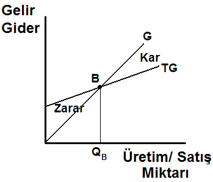
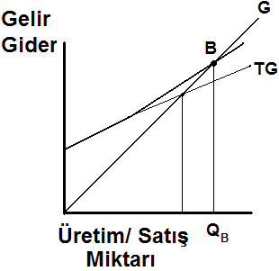
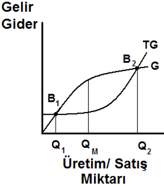
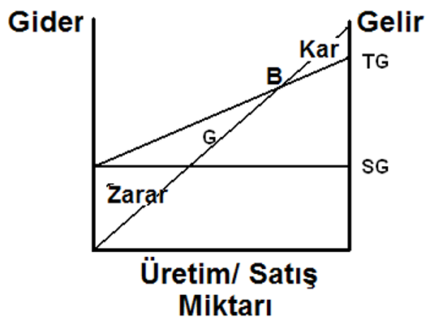
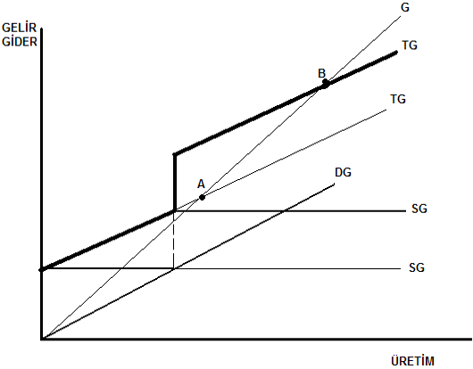
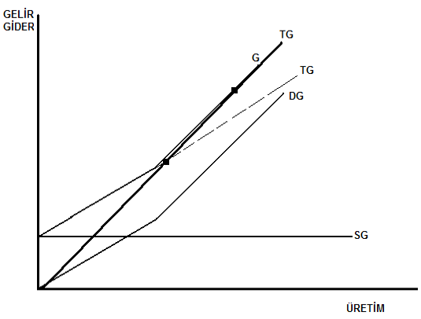
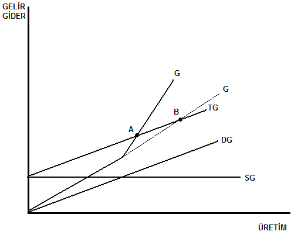
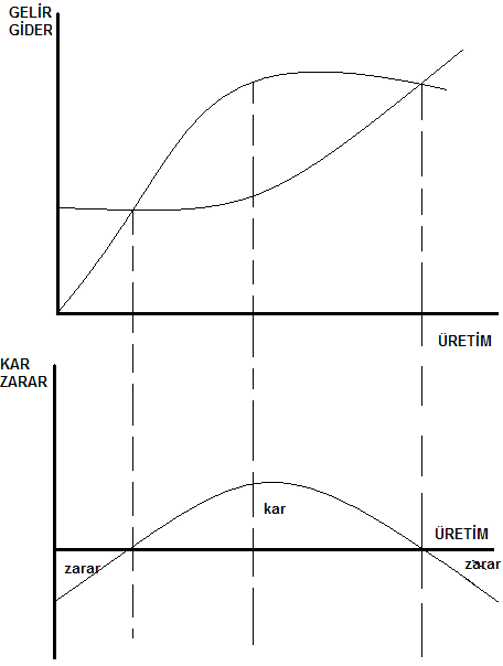

**Başa Baş Noktası:** İşletmenin gelir v e giderlerinin eşit olduğu diğer bir deyişle karının 0 olduğu noktaya başabaş noktası denir.

Gelir ve giderin lineer olduğu işletmelerde başa baş noktasının grafiği

Gelir ve giderin lineer giderin belli bir üretim miktarından sonra lineer arttığı işletmelerde başa baş noktası grafiği 

Gelir ve giderin nonlineer olduğu işletmelerde başa baş noktasının grafiği

Başa baş noktası analiz yönetmleri
* Geleneksel
* Lineer
* Nonlineer

**Kullanım Yerleri**
* Gider-Kar ilişkilerinin tayininde
* Üretim düzeyi-Gider ilişkilerinin tayininde
* Birim satış fiyatı-Kar arası ilişkinin tayininde
* Kar ile üretim hacmi arasındaki ilişkinin tayininde
* Kara geçebilmek için gerekli ürün fiyatının tespitinde
* Birden fazla ürünün üretildiği işlemelerde en karlı ürünün tayininde

**Geleneksel Başa Baş Noktası Analizi**
* Üretim miktarı belirlenmelidir
* Gider ve gelir eğrileri lineerdir
* Maliyetler sabit ve değişken olarak ayrılabilir
* Sabit maliyetler değişmez
* Birim değişken giderler sabittir
* Stoklar hesaba katılmaz ihmal edilebilir niteliktedir
* Hammadde işçilik ve benzeri kalemlerin maliyetleri sabittir
* Üretim verimliliği sabittir

## Grafik Yöntemi

## Matematiksel Yöntem
* SG=Sabit Gider
* DG=Değişken Gider
* d=Birim Değişken Gider
* b=Birim Satış Fiyatı
* Q=Üretim Miktarı
* G=Gelir
* TG=Toplam Gider
* K=Kar

$$
G=Q\times b
$$

$$
TG=Q\times b+SG
$$

$$
K=G-TG=Q\times\left(b-d\right)-SG
$$

**Üretilecek Mal Mitarı Açısından**
$$
Q=\frac{SG}{b-d}
$$

**Satış Geliri Açısından**
$$
R=\frac{SG}{1-{\displaystyle\frac{DG}G}}
$$
(R=Başa baş noktasındaki satış geliri)

**Kapasite Kullanım Oranı Açısından**
$$
Kapasite\;Yüzdesi\;=\frac{SG}{bQ-dQ}
$$

**Amaçlanan Kar Miktarına Göre**
$$
Q_{kar}=\frac{K+SG}{b-d}
$$

**Gelir Vergisinin Hesaba Dahil Edilmesi**
$$
y=\frac z{1-t}
$$
(y=vergiden önceki kar
t=vergi oranı
z=vergiden sonraki kar)

**Örnek 1**
İşletmenin toplam sabit gideri 10.000 TL, birim değişken gideri ise 600 TL/br, satış fiyatı 1000 TL/br'dir.
**a)** Başa baş noktasına ulaşmak için satılması gereken ürün miktarı ne olmalıdır? 
**b)** Başa baş noktasındaki satış geliri ne olmalıdır?

**Çözüm 1**

* SG=10000TL
* d=600TL/br
* b=1000TL/br

**a)**
$$
Q=\frac{SG}{b-d}
$$

$$
Q=\frac{10000}{1000-600}
$$

Q=25 m^3

**b)**
$$
R=\frac{SG}{1-{\displaystyle\frac{DG}G}}
$$

$$
R=\frac{10000}{1-{\displaystyle\frac{600\times25}{1000\times25}}}
$$

R=25000TL

**Örnek 2**
İşletemeye ait aşağıdaki bilgiler verilmiştir.
* Elektrik: 100 TL/m^3
* Mazot ve Yağ: 500 TL/m^3
* Lastik ve Yedek Parça: 400 TL/m^3
* Patlayıcı Madde: 300 TL/m^3
* Diğer Değişken Giderler: 200 TL/m^3
* Amortisman, Faiz ve Sigorta: 1500000 TL/yıl
* Personel: 500000 TL/yıl
* Diğer Sabit Giderler: 125000 TL/yıl

* Gelir: 4000 TL/m^3
* Üretim Kapasitesi: 1500000 m^3/yıl

**a)** Başa baş noktasını üretim miktarı olarak bulunuz.
**b)** Firmanın yıllık karının 500000TL/yıl kara ulaşması için gerekli üretim miktarını bulunuz.

**Çözüm 2**
* d= 100+500+400+300+200 = 1500 TL/m^3
* b= 4000 TL/m^3
* SG= 1500000+500000+125000 = 2250000 TL/yıl
* Üretim Kapasitesi: 1500000 m^3/yıl

**a)**
$$
Q=\frac{SG}{b-d}
$$

$$
Q=\frac{2250000}{4000-1500}
$$
=900 m^3

**b)**
$$
Q_{kar}=\frac{K+SG}{b-d}
$$

$$
Q_{kar}=\frac{500000+2250000}{4000-1500}
$$
=1100 m^3

**Örnek 3**
Aşağıdaki koşullar altında işletme 1000 ton kömür satışından 70000 TL kar elde etmektedir. İşletmenin hedeflenen kar üzerinden %30 gelir vergisini ödedikten sonra hedeflediği kara ulaşması için gerekli üretimi ne olmalıdır?
* b= 150 TL/ton
* d= 50 TL/ton
* SG= 30000 TL

**Çözüm 3**
$$
y=\frac z{1-t}
$$
$$
y=\frac{70000}{1-0.3}
$$
=100000TL
K=100000TL ise

$$
Q_{kar}=\frac{K+SG}{b-d}
$$

$$
Q_{kar}=\frac{100000+30000}{150-50}
$$
=1300 ton

## Lineer Başa Baş Nokta Analizi

Dg sabit, sg ise belirli bir üretim sonra artıyor, bağlı olarak tg artar ve başa baş noktası, a’dan b’ye değişir

Sg sabit, dg ise belirli bir üretim sonra artıyor, bağlı olarak tg artar ve başa baş noktası, a’dan b’ye değişir

Sg sabit, dg sabit, g ise belirli bir üretim sonra artıyor, başa baş noktası, b’den a’ya değişir
## Lineer Olmayan Başa Baş Nokta Analizi
İki adet (alt-üst) başa baş noktası vardır, ve maksimum kar, gelir gider eğrileri arasındaki farkın en çok olduğu noktadadır. Başa baş noktalarının ötelerinde ise zarar söz konusudur

Kar; gelir ve toplam maliyet eğrilerinin eğimlerinin eşit olduğu noktada maksimum olur.
Marjinal maliyet = Marjinal gelir
Marjinal kar = Üretim miktarına göre kar değişim oranıdır.
Maksimum kar noktasında değişim oranı 0’dır  
$$
\frac{\partial K}{\partial Q}=\frac{\partial(Q\times b-Q\times d-SG)}{\partial Q}=0
$$

$$
\frac{\partial(Qb)}{\partial Q}=\frac{\partial(Q\times d+SG)}{\partial Q}
$$
**Lineer Fonksiyonlar İçin;**
OTM Artan üretim miktarlarında düşecektir. Bu yüzden mm, otm’den daha küçük olacaktır.
$$
OTM=\frac{Qd+SG}Q
$$

$$
MM=\frac{\partial(Qd+SG)}{\partial Q}
$$
**Lineer Olmayan Fonksiyonlar İçin;**
OTM Artan üretim miktarlarında önce azalıp sonra artmaktadır. Bu yüzden bir evvelki durum burada söz konusu olmaz. Eğrinin eğimi, en düşük OTM için yapılan üretimde 0’a eşit olur. Minimum ortalama toplam maliyet noktası ile maksimum kar noktası kesişmeyebilir.
$$
\frac{\partial(d-SGQ^{-1})}{\partial Q}=0
$$

$$
\frac{\partial(d)}{\partial Q}-\frac{\partial SG}{\partial Q^2}
$$

**Örnek 1**
Bir maden işletmesinde tutulan kayıtlardan elde edilen bilgilere göre, işletmenin gelir gider durumuna ait bilgiler aşağıdaki şekliyle elde edilmiştir.

* sabit maliyetler = 200.000 tl/ay
* satış fiyatı = 100-0,001n tl/br
* değişken maliyetler = 0,005n+4 tl/br
* aylık üretim kapasitesi = 15.000 ton/ay

başa baş noktasını;
a) maksimum kara
b) minimum ortalama maliyete göre hesaplayınız
c) başa baş noktasındaki üretim miktarlarını bulunuz

**Çözüm 1**
a) 
1. Yol: maksimum kara göre; marjinal maliyet=marjinal gelir ise kar maksimum olur.
$$
\begin{array}{l}MG=\frac{\partial(nb)}{\partial n}=\frac{\partial(100n-0.001n^2)}{\partial n}\\=100-0.002n\end{array}
$$

$$
\begin{array}{l}MM=\frac{\partial(DG+SG)}{\partial n}=\frac{\partial(0.005n^2+4n+200000)}{\partial n}\\=0.01n+4\end{array}
$$
$$
\begin{array}{l}100-0.002n=0.01n+4\\n=8000br\end{array}
$$

2. Yol: maksimum kar için üretim miktarı; marjinal karın 0’a eşit olduğu noktada oluşan miktadır.
$$
\begin{array}{l}MK=\frac{\operatorname dK}{\operatorname dn}=\frac{\partial(-0.006n^2+96n-200000)}{\partial n}=0\\0=-0.012n+96\\n=8000br\end{array}
$$

8.000 birim üretimden elde edilecek kar;
$$
\begin{array}{l}K=G-M\\=100n-0.001n^2-0.005n^2-4n-200000\\=-0.006n^2+96n-200000\\=-0.006\times(8000)^2+96\times8000-200000\\=184000\end{array}
$$

Minimum ortalama maliyet için başa baş noktası; 
$$
\begin{array}{l}\frac{\displaystyle\partial d}{\displaystyle\partial Q}=\frac{\displaystyle SG}{\displaystyle Q^2}\\=\frac{\partial d}{\partial n}=\frac{SG}{{\displaystyle n}^2}\\=\frac{\partial(0.005n+4)}{\partial n}=\frac{200000}{n^2}\\=0.005n^2=200000\\=n=6325br\\\\\end{array}
$$

Başa baş üretim miktarı; kar’ın 0 olduğu noktadır.
$$
\begin{array}{l}K=0=-0.006n^2+96n-200000\\\\n_{1,2}=\frac{96\pm\sqrt{96^2-4\times0.006\times200000}}{2\times0.006}\\n_{1,2}=\frac{96\pm66.4}{0.012}\\n_1=2467br\\n_2=13533br\end{array}
$$