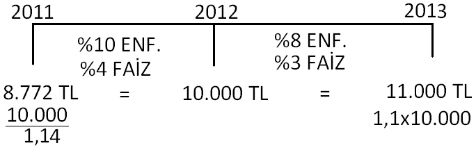
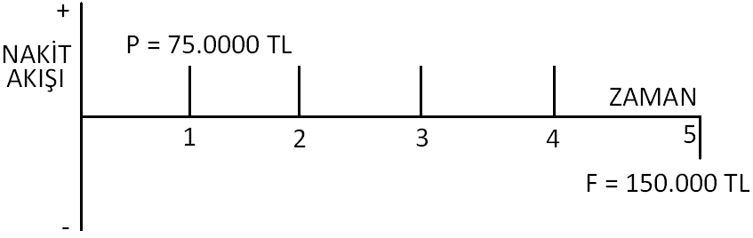

### Faiz
Bir zaman dilimi sonunda para miktarında meydana gelen artışa faiz denir. Faiz = Günümüzde Geri Ödenen Miktar - İlk Borç

#### Faiz Oranı
Faiz Oranı (%) = Birim Zamanda Gerçekleşen Faiz*100 / İlk Miktar

#### Örnek
Bir yıl önce bugün 10000 TL olarak bankaya yatırılan miktar, bugün 11750 TL olarak geri alınmıştır. Faiz miktarını ve oranını yıllık bazda bulunuz.

Faiz = 11750 - 10000 = 1750 TL

FO= 1750*100/10000 = 17,5%

### Eşdeğerlilik
Paranın farklı zamanlardaki miktarlarının faiz ve/veya enflasyon değerlerinde hareket ederek eşitlenmesidir.

### Basit Faiz Hesapları
Daha önce gerçekleşen faiz değerlerini dikkate almadan, sadece ana para üzerinden gerçekleştirilen faiz hesaplarına basit faiz denir.

Basit Faiz = Ana Para * Peryod Sayısı * Faiz Oranı

#### Örnek
5 yıllığına yılda %12 faiz oranı ile alınan 25000 TL borcun beş yıl sonraki ödemesi ne kadar olur?

Ödeme = 25000*5*0,12+25000 = 40000 TL

| Yıl Sonu | Alınan Borç | Faiz Miktarı | Borç Miktarı | Ödeme |
| ----- | ----- | ----- | ---- | ---- |
| 0 | 25000 | - | - | - |
| 1 | - | 3000 | 28000 | - |
| 2 | - | 3000 | 31000 | - |
| 3 | - | 3000 | 34000 | - |
| 4 | - | 3000 | 37000 | - |
| 5 | - | 3000 | 40000 | 40000 |

### Bileşik Faiz
Paranın zaman değeri dikkate alınarak gerçekleştirilen faiz hesaplarına denir. Her yıl için faiz hesaplanırken, bir önceki yıl için ana para + faiz miktarından elde edilen değer dikkate alınır.

#### Örnek
5 yıllığına yılda %12 bileşik faiz oranı ile alınan 25000 TL borcun beş yıl sonraki ödemesi ne kadar olur?

| Yıl Sonu | Alınan Borç | Faiz Miktarı | Borç Miktarı | Ödeme |
| ----- | ----- | ----- | ---- | ---- |
| 0 | 25000 | - | - | - |
| 1 | - | 3000 | 28000 | - |
| 2 | - | 3360 | 31360 | - |
| 3 | - | 3763 | 35123 | - |
| 4 | - | 4215 | 39338 | - |
| 5 | - | 4721 | 44059 | 44059 |

#### Bileşik Faiz Hesaplamaları

Kullanılan notasyonlar;
i: dönemlik faiz oranı, n: dönem sayısı, P: paranın bugünkü değeri, F: paranın gelecek zamandaki değeri, A: dönem sonu ödemeler

##### Örnek
Günümüzde 75000 TL olarak yılda %20 faizle alınan bir paranın 5 yıl sonraki ödemesi ne kadar olur?

P = 75000 TL, i = 20% - yıl, n = 5 yıl, A = 0 ise F=?

$ F=\;75000\ast0,2\ast5\ast75000\;=\;150000\;TL $

### Nakit Akış Diyagramları
Net Nakit Akışı = Gelirler - Giderler

#### Örnek
Günümüzde 75000 TL olarak yılda %20 faizle alınan bir paranın 5 yıl sonraki ödemesi ne kadar olur sorusuna ait diagramı çizin.

## Bileşik Faiz Faktörleri ve Kullanımları

### 1) Tek Ödeme Bileşik Değer Formülleri

Aşağıda verilen formül bugünkü değeri P olan ve n sene boyunca i oranından faize yatırılan paranın n sene sonraki F değerini bulmada kullanılır.

$ F=P\ast(1+i)^n $

#### Örnek
%12 faizle 4 yıllığına faize yatırılan 10000 TL'nin 4 yıl sonundaki değerini bulunuz.

$ F=10000\ast(1+0,12)^4=17735\;TL $

### 2) Tek Ödeme Bugünkü Değer Formülleri
Aşağıda verilen formül n sene sonraki F değerini i faiz ortamında eşdeğeri olan bugünkü P değerini bulmada kullanılır. 

$ P=F\ast(1+i)^-n $

#### Örnek
5 yıl sonra %12 faizle 10000 TL elde etmek için yatırılması gereken paranın bugünkü değeri nedir?

$ P=10000\ast(1+0,12)^{-5}=5674\;TL $

### 3) Düzgün Seri Bugünkü Değer Formülleri
Aşağıda verilen formül i faiz ortamında 1. yıldan n. yıla kadar her dönem sonu yapılan A miktarındaki yatırımın bugünkü P değerini verir.

$ P=A\ast\left[\frac{(1+i)^n-1}{i\ast(1+i)^n}\right] $

#### Örnek
5 yıl boyunca her yıl sonunda %8 faizle yatırılan 10000 TL'nin bugünkü değeri nedir?

$ P=10000\ast\left[\frac{(1+0,08)^5-1}{0,08\ast(1+0,08)^5}\right]=\;39925\;TL $

### 4) Sermayenin Yeniden Elde Edilmesi
Aşağıda verilen formül P sermayesinin n yıl içerisinde i faiz oranı ile her dönem sonu getireceği A miktarını göstermektedir.

$ A=P\ast\left[\frac{i\ast(1+i)^n}{(1+i)^n-1}\right] $

### 5) Tasarruf Miktarı Formülü
Aşağıda verilen formül n dönem sonunda F değerini elde etmek için i faiz oranında her dönem sonu yatırılması gereken A değerinin tayininde kullanılır.

$ A=F\ast\left[\frac i{(1+i)^n-1}\right] $

### Bileşik Değer Formülü
Aşağıda verilen formül her dönem sonu A miktarda yatırım yapıp, i faiz ortamında n dönem sonunda elde edilecek F değerinin tayininde kullanılır.

$ F=A\ast\left[\frac{(1+i)^n-1}i\right] $