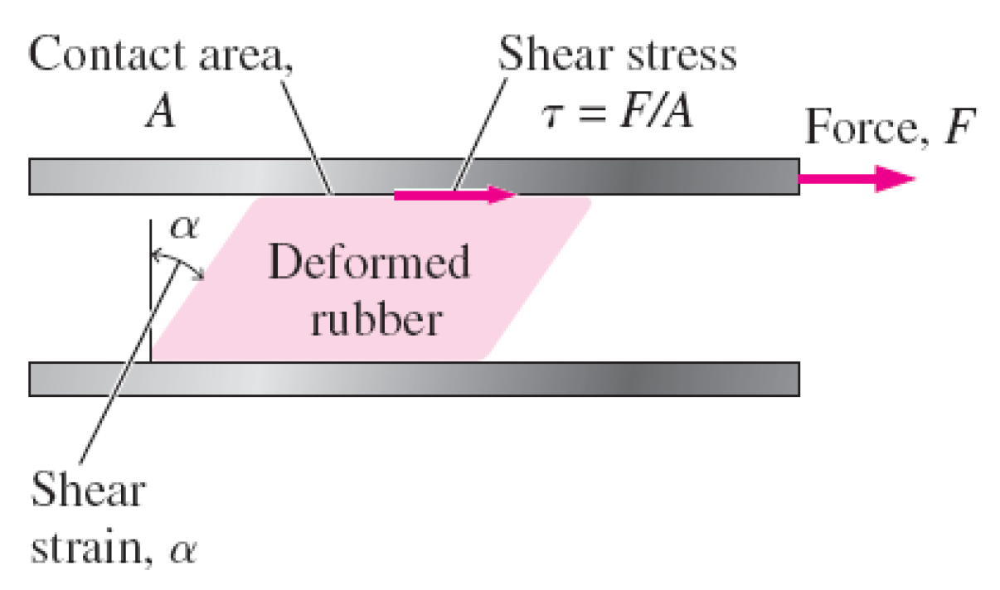
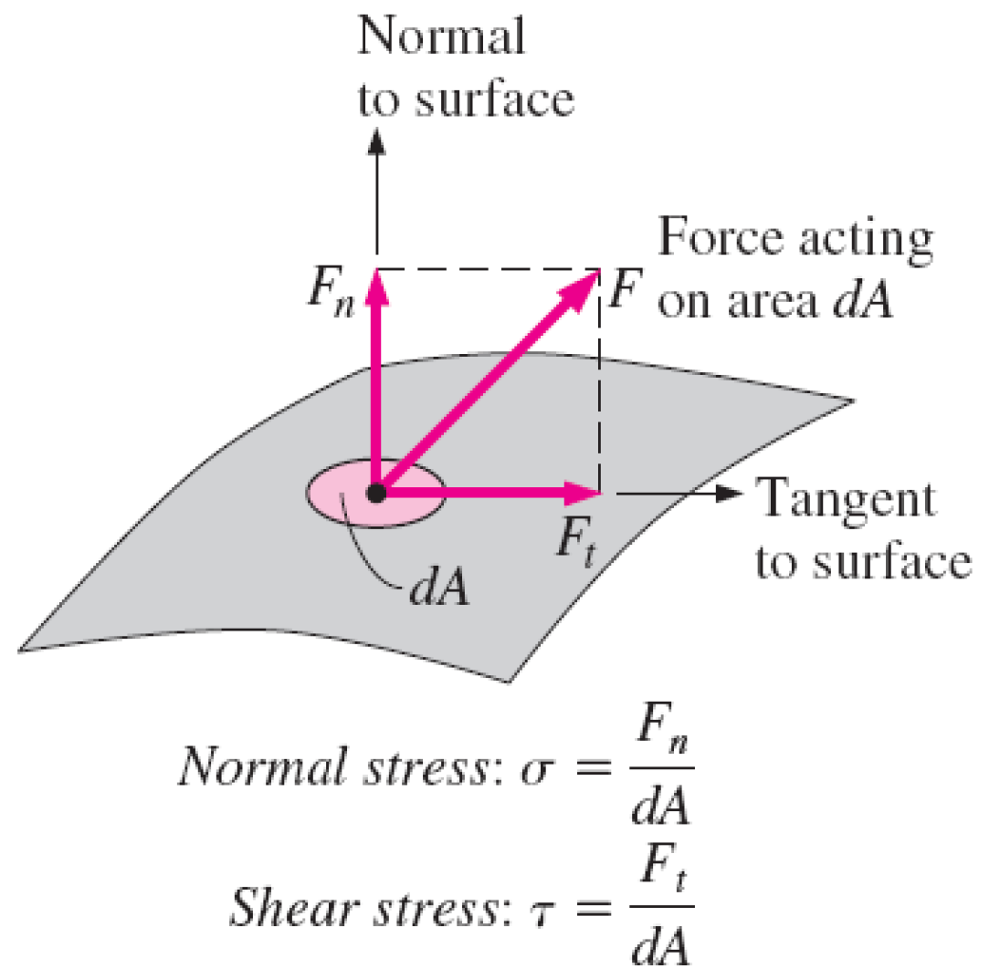
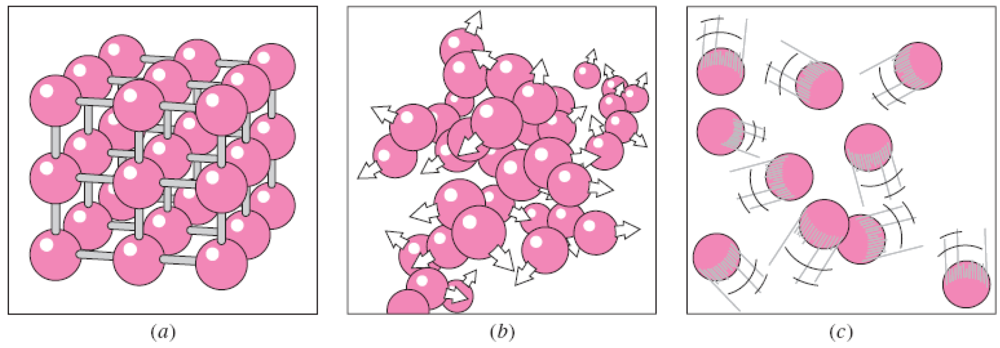
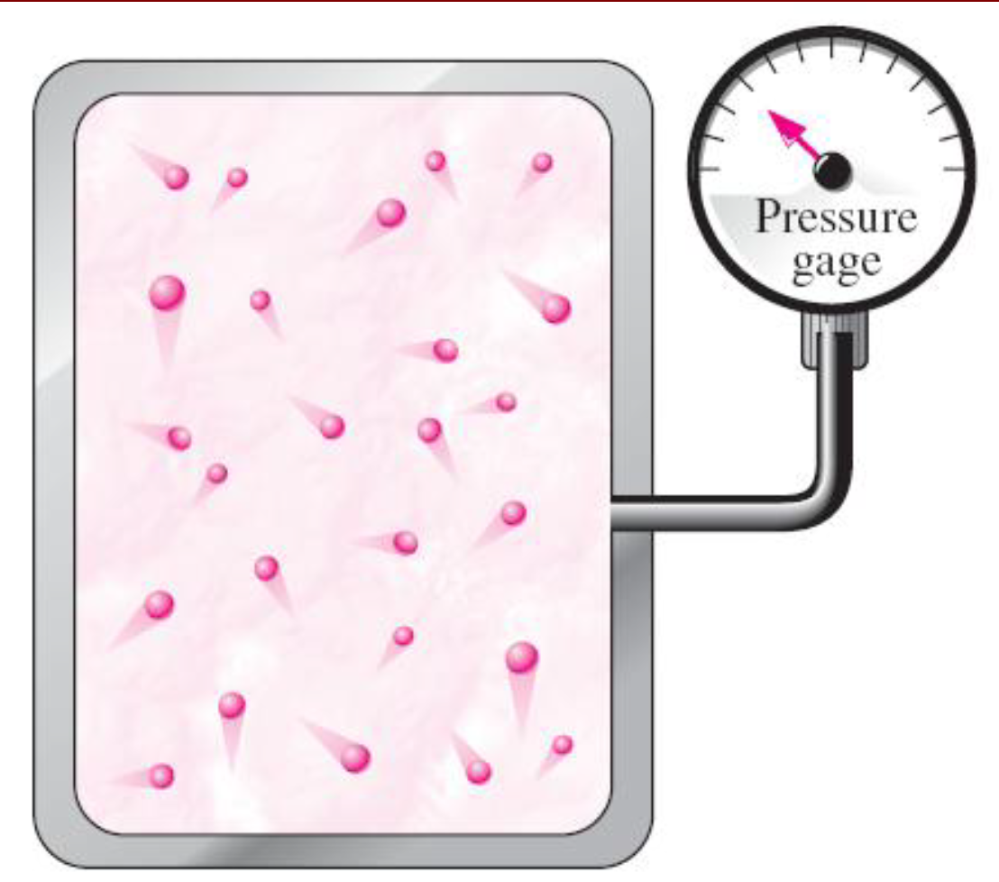
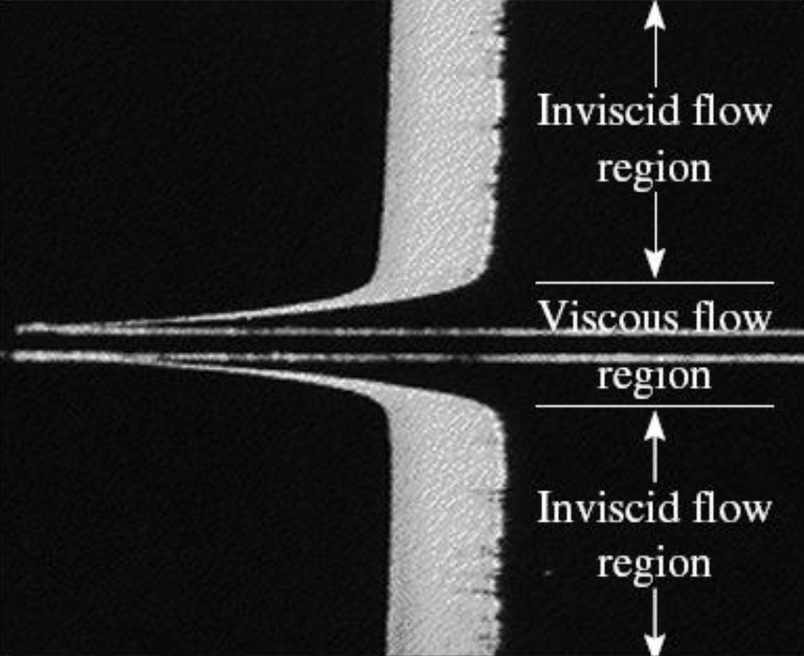

# Giriş
## Tanımlar
Mekanik: Kuvvetlerin etkisindeki durağan ve hareketli cisimler ile ilgilenen fizik biliminin en eski dalıdır.

Statik: Mekaniğin hareketsiz cisimler ile ilgili dalıdır.

Dinamik: Hareketli cisimler ile ilgili dalıdır.

Akışkan mekaniği: Alt dalı ise; akışkanların durağan haldeki (fluid statics) ya da hareket halindeki (fluid dynamics) davranışları ve akışkanların diğer akışkanlar ve katılar ile oluşturdukları sınırlardaki etkileşimleri ile ilgilenen bilim dalı.

Akışkan dinamiği: Akışkanın durağan hali, hareken hızının sıfır olduğu özel bir durum.

Hidrodinamik: Uygulamada sıkıştırılamaz kabul edilen akışkanların (sıvılar, su ve düşük hızlarda hareket eden gazlar) hareketi ile ilgili çalışmalar.

Hidrolik: Sıvıların boru ve kanallardaki akışı ile ilgienen alt dalı.

Gaz dinamiği: Gazların yüksek hızlarda lülelerden akması gibi akışkan yoğunluğunun akışkan yoğunluğunun önemli miktarlarda değiştiği akışlar ile
ilgilenir.

Aerodinamik: Gazların (özellikle havanın) uçak, roketler ve otomobiller gibi cisimlerin etrafındaki yüksek ve düşük hızlı akışı ile ilgilenir.

Meteoroloji, Oşinografi ve Hidroloji: Doğal olarak oluşan akışlarla ilgilenir.

Akışkan: Sıvı ve gaz halindeki madde akışkan olarak nitelendirilir. Katı, uygulanan kayma gerilmesine bir miktar deforme olarak direnebilir. Sıvı, kayma gerilmesi ne kadar küçük olursa olsun sürekli şekil değiştirir. Katılarda, gerilme, şekil değiştirme ile orantılıdır. Fakat sıvılarda şekil değiştirme hızı ile orantılıdır. Sabit kayma gerilmesi uygulandığında, katının şekil değiştirmesi belirli bir noktada son bulurken, sıvının şekil değiştirmesi asla durmaz ve belirli bir şekil değiştirme hızına yaklaşır.

İki tabaka arasına yerleştirilen lastik takozun kayma kuvveti etkisi ile şekil değiştirmesi. Kayma gerilmesi takozun altında oluşur - eşit fakat ters kayma gerilmesi takozun üstünde oluşur.

Gerilme: Birim alana etkiyen kuvvet.

Normal gerilme: Yüzeyin birim alanına etkiyen kuvvetin dik bileşeni.

Kayma gerilmesi: Yüzeyin birim alanına etkiyen kuvvetin yüzeye teğetsel bileşeni.

Basınç: Durgun akışkanlardaki normal gerilme.

Sıfır kayma gerilmesi: Akışkanın hareketsiz hali kayma gerilmesinin sıfır olduğu durumdur. Kabın çeperi ortadan kaldırıldığında ya da kap eğildiğinde kayma başlar, akışkan sıçrar ya da serbest bir yüzey oluşturacak şekilde hareket eder.

Akışkan elemanının yüzeyindeki normal gerilme ve kayma gerilmesi. Durgun akışkanlarda kayma gerilmesi sıfırdır ve basınç sadece normal gerilmeden ibarettir.

Sıvılarda, molekül grupları birbirlerine göre bağıl olarak hareket edebilir fakat moleküller arasındaki güçlü kohezyon kuvvetleri sebebi ile hacimleri sabittir. Sonuç olarak sıvı, içerisinde bulundukları kabın şeklini alır ve yerçekiminin etkisi ile serbest yüzey oluşturur. Gaz kabın çeperlerine ulaşıncaya kadar genişler ve mevcut hacmin tamamını doldurur. Kohezyon kuvvetleri azdır. Serbest yüzey oluşturmazlar.

Gazlar sıvılardan farklı olarak serbest yüzey oluşturmaz ve genişleyerek mevcut hacmin tamamını doldurur.

Moleküllerarası bağ katılarda en güçlü, gazlarda en zayıftır.
Katı: Moleküller birbirlerine çok yakın ve aynı düzendedir.
Sıvı: Moleküller arası mesafe katılardan farklı olmamasına rağmen birbirlerine göre döner ve hareket edebilirler.
Gaz: Moleküller arası mesafe çok uzaktır ve serbestçe hareket edebilirler.

Maddenin farklı fazlardaki atom düzenleri: (a) katılarda moleküllerin konumları sabittir, (b) sıvılarda moleküller gruplar halinde, ve (c) gazlarda ise gelişigüzel hareket eder.

Gaz ve buhar çoğu zaman aynı anlamda kullanılan kelimelerdir.
Gaz: Bir maddenin buhar fazı, çoğunlukla kritik bir sıcaklığın üzerinde ise gaz olarak adlandırılır.
Buhar: Genellikle yoğuşma koşullarına çok yakın gaz halini ifade eder.

Makroskopik ya da klasik yaklaşım: Tek tek moleküllerin nasıl haraket ettikleri ile ilgilenmez, mühendislik problemlerinin doğrudan ve daha kolay çözülmesini sağlar.

Microskopik ya da istatistiksel yaklaşım: Geniş grupların ya da moleküllerin bireysel hareketlerine dayanır.

Basınç, mikroskopik ölçekte moleküllerin etkileşimi ile belirlenirken makroskopik ölçekte bir manometre ile ölçülebilir.

## Akışkanlar Mekaniğinin Uygulama Alanları

1. Yapay kalp yapımı
2. Doğal akış ve hava durumu
3. Güç üniteleri (Enerji santralleri)
4. Deniz araçları
5. İnsan vücudu
6. Uçak ve uzay araçları
7. Arabalar
8. Rüzgar türbinleri
9. Boru sistemleri
10. Endüstriyel uygulamalar

## Kaymama Koşulu
Kenar tabaka: Viskoz etkilerin (hız profillerinin) önemli olduğu yüzeye yakın akış bölgesine sınır tabaka adı verilir.

Hareketsiz bir yüzey üzerinden akan akışkan, kaymama koşulundan dolayı yüzeye temas ettiğinde tamamen durur.

## Akışların Sınıflandırılması
### Viskoz ve Viskoz Olmayan Akış Bölgeleri

Viskoz Akışlar: Sürtünme etkilerinin önemli olduğu akış.

Viskoz olmayan akış bölgeler: Uygulamada karşılaşılan akışların çoğunda viskoz kuvvetlerin atalet ve basınç kuvvetlerinin yanında ihmal edilebilecek kadar küçük kaldığı bölgeler (katı yüzeylerden uzak bölgeler).

Düz plaka üzerinde üniform hızlı akıştaki viskoz (plakanın her iki tarafına bitişik) ve viskoz olmayan (plakadan uzaktaki) akış bölgeleri.

