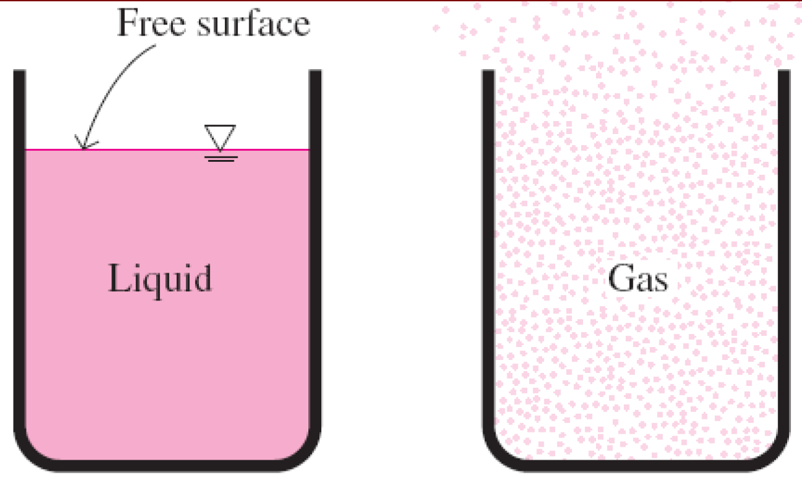

## Tanımlar
**Mekanik:** Kuvvetlerin etkisindeki durağan ve hareketli cisimler ile ilgilenen fizik biliminin en eski dalıdır.

**Statik:** Mekaniğin hareketsiz cisimler ile ilgili dalıdır.

**Dinamik:** Hareketli cisimler ile ilgili dalıdır.

**Akışkan mekaniği:** Alt dalı ise; akışkanların durağan haldeki (fluid statics) ya da hareket halindeki (fluid dynamics) davranışları ve akışkanların diğer akışkanlar ve katılar ile oluşturdukları sınırlardaki etkileşimleri ile ilgilenen bilim dalı.

**Akışkan dinamiği:** Akışkanın durağan hali, hareken hızının sıfır olduğu özel bir durum.

**Hidrodinamik:** Uygulamada sıkıştırılamaz kabul edilen akışkanların (sıvılar, su ve düşük hızlarda hareket eden gazlar) hareketi ile ilgili çalışmalar.

**Hidrolik:** Sıvıların boru ve kanallardaki akışı ile ilgienen alt dalı.

**Gaz dinamiği:** Gazların yüksek hızlarda lülelerden akması gibi akışkan yoğunluğunun akışkan yoğunluğunun önemli miktarlarda değiştiği akışlar ile ilgilenir.

**Aerodinamik:** Gazların (özellikle havanın) uçak, roketler ve otomobiller gibi cisimlerin etrafındaki yüksek ve düşük hızlı akışı ile ilgilenir.

**Meteoroloji, Oşinografi ve Hidroloji:** Doğal olarak oluşan akışlarla ilgilenir.

**Akışkan:** Sıvı ve gaz halindeki madde akışkan olarak nitelendirilir. Katı, uygulanan kayma gerilmesine bir miktar deforme olarak direnebilir. Sıvı, kayma gerilmesi ne kadar küçük olursa olsun sürekli şekil değiştirir. Katılarda, gerilme, şekil değiştirme ile orantılıdır. Fakat sıvılarda şekil değiştirme hızı ile orantılıdır. Sabit kayma gerilmesi uygulandığında, katının şekil değiştirmesi belirli bir noktada son bulurken, sıvının şekil değiştirmesi asla durmaz ve belirli bir şekil değiştirme hızına yaklaşır. İki tabaka arasına yerleştirilen lastik takozun kayma kuvveti etkisi ile şekil değiştirmesi. Kayma gerilmesi takozun altında oluşur - eşit fakat ters kayma gerilmesi takozun üstünde oluşur.

**Gerilme:** Birim alana etkiyen kuvvet.

**Normal gerilme:** Yüzeyin birim alanına etkiyen kuvvetin dik bileşeni.

**Kayma gerilmesi:** Yüzeyin birim alanına etkiyen kuvvetin yüzeye teğetsel bileşeni.

**Basınç:** Durgun akışkanlardaki normal gerilme.

**Sıfır kayma gerilmesi:** Akışkanın hareketsiz hali kayma gerilmesinin sıfır olduğu durumdur. Kabın çeperi ortadan kaldırıldığında ya da kap eğildiğinde kayma başlar, akışkan sıçrar ya da serbest bir yüzey oluşturacak şekilde hareket eder.

Akışkan elemanının yüzeyindeki normal gerilme ve kayma gerilmesi. Durgun akışkanlarda kayma gerilmesi sıfırdır ve basınç sadece normal gerilmeden ibarettir.

Sıvılarda, molekül grupları birbirlerine göre bağıl olarak hareket edebilir fakat moleküller arasındaki güçlü kohezyon kuvvetleri sebebi ile hacimleri sabittir. Sonuç olarak sıvı, içerisinde bulundukları kabın şeklini alır ve yerçekiminin etkisi ile serbest yüzey oluşturur. Gaz kabın çeperlerine ulaşıncaya kadar genişler ve mevcut hacmin tamamını doldurur. Kohezyon kuvvetleri azdır. Serbest yüzey oluşturmazlar.

Gazlar sıvılardan farklı olarak serbest yüzey oluşturmaz ve genişleyerek mevcut hacmin tamamını doldurur.

Moleküllerarası bağ katılarda en güçlü, gazlarda en zayıftır.

**Katı:** Moleküller birbirlerine çok yakın ve aynı düzendedir.

**Sıvı:** Moleküller arası mesafe katılardan farklı olmamasına rağmen birbirlerine göre döner ve hareket edebilirler.

**Gaz:** Moleküller arası mesafe çok uzaktır ve serbestçe hareket edebilirler.

Maddenin farklı fazlardaki atom düzenleri: (a) katılarda moleküllerin konumları sabittir, (b) sıvılarda moleküller gruplar halinde, ve (c) gazlarda ise gelişigüzel hareket eder.

Gaz ve buhar çoğu zaman aynı anlamda kullanılan kelimelerdir.

**Gaz:** Bir maddenin buhar fazı, çoğunlukla kritik bir sıcaklığın üzerinde ise gaz olarak adlandırılır.

**Buhar:** Genellikle yoğuşma koşullarına çok yakın gaz halini ifade eder.

**Makroskopik ya da klasik yaklaşım:** Tek tek moleküllerin nasıl haraket ettikleri ile ilgilenmez, mühendislik problemlerinin doğrudan ve daha kolay çözülmesini sağlar.

**Mikroskopik ya da istatistiksel yaklaşım:** Geniş grupların ya da moleküllerin bireysel hareketlerine dayanır.

Basınç, mikroskopik ölçekte moleküllerin etkileşimi ile belirlenirken makroskopik ölçekte bir manometre ile ölçülebilir.

## Akışkanlar Mekaniğinin Uygulama Alanları

1. Yapay kalp yapımı
2. Doğal akış ve hava durumu
3. Güç üniteleri (Enerji santralleri)
4. Deniz araçları
5. İnsan vücudu
6. Uçak ve uzay araçları
7. Arabalar
8. Rüzgar türbinleri
9. Boru sistemleri
10. Endüstriyel uygulamalar

## Kaymama Koşulu
**Kenar tabaka:** Viskoz etkilerin (hız profillerinin) önemli olduğu yüzeye yakın akış bölgesine sınır tabaka adı verilir. Hareketsiz bir yüzey üzerinden akan akışkan, kaymama koşulundan dolayı yüzeye temas ettiğinde tamamen durur.

## Akışların Sınıflandırılması
### Viskoz ve Viskoz Olmayan Akış Bölgeleri

**Viskoz akışlar:** Sürtünme etkilerinin önemli olduğu akış türüne denir.

**Viskoz olmayan akış bölgeler:** Uygulamada karşılaşılan akışların çoğunda viskoz kuvvetlerin atalet ve basınç kuvvetlerinin yanında ihmal edilebilecek kadar küçük kaldığı bölgelere denir (katı yüzeylerden uzak bölgeler).

Düz plaka üzerinde üniform hızlı akıştaki viskoz (plakanın her iki tarafına bitişik) ve viskoz olmayan (plakadan uzaktaki) akış bölgeleri.

### İç ve Dış Akışlar
**Dış akış:** Bir akışkanın bir plaka, bir tel ya da boru gibi bir yüzeyin üzerinden herhangi bir sınır olmaksızın akması.

**İç akış:** Şayet akışkan katı yüzeylerle tamamen sınırlandırılmış ise, yani akış bir boru ya da kanal içindeyse.

Boru içi akış iç akış, tenis topu etrafındaki akış dış akıştır. Kanalın sadece bir kısmını dolduran serbest yüzeyli sıvı akışları, açık kanal akışı olarak adlandırılır.

### Sıkıştırılabilir ve Sıkıştırılamaz Akışlar
**Sıkıştırılamaz akış:** Yoğunluk akış boyunca her yerde neredeyse sabit kalıyorsa akış sıkıştırılamazdır. (ör: sıvı akışı).

**Sıkıştırılabilir akış:** Yoğunluk akış boyunca değişiyorsa sıkıştırılabilir akıştır. Örneğin, yüksek hızlı gaz akışı. Uzay araçları, roketler söz konusu olduğunda akış hızı genellikle Mach number olarak tanımlanır.

$ Ma = V / c = Speed of flow / Speed of sound $

* Ma = 1 Ses hızı akışı
* Ma < 1 Sesaltı akışı
* Ma > 1 Sesüstü akışı
* Ma >> 1 Hipersonik akış

### Laminar ve Türbülanslı Akışlar
**Laminer akış:** Çalkantısız akışkan tabakaları ile karakterize edilen çok düzenli akışkan hareketi.

**Türbülanslı akış:** Genellikle yüksek hızlarda görülen ve hız çalkantıları olarak nitelendirilen çok düzensiz akışkan hareketleri.

**Geçiş akışı:** Laminer ve türbülanslı akış arasında olan akış.

### Doğal ve Zorlanmamış Akışlar
**Zorlanmış akış:** Pompa ya da fan gibi dış etkenler ile bir borunun veya bir yüzeyin üzerinden akmaya zorlanır.

**Doğal akış:** Herhangi bir akışkan hareketi, ılık (yani az yoğun) akışkanın yükselmesi ve soğuk (çok yoğun) akışkanın alçalması ile kendiliğinden oluşan kaldırma etkisi gibi doğal nedenlerden olur.

Şiliren (schlieren) görüntüsündeki az yoğun bölge, sıcak havanın yükselmesi, insanların ve sıcak-kanlı hayvanların yükselen, ılık bir hava tabakası ile sarılı olduğunu göstermektedir.

### Daimi ve Daimi Olmayan Akışlar
Daimi terimi bir noktada zaman içerisinde hiçbir değişim olmadığını ifade eder. Daimi'nin karşıtı daimi olmayandır. Uniform terimi belirlenmiş bir bölgede konuma bağlı hiçbir değişim olmadığını ifade eder. Periodik terimi akışın düzenli bir şekilde salınım yaptığı bir tür daimi olmayan akımlar için kullanılır. Türbin, kompresör, kazan gibi birçok cihaz uzun süre aynı koşullarda çalışır ve daimi-akışlı makinalar olarak adlandırılır. 

### Bir, İki ve Üç Boyutlu Akışlar
Bir akış en iyi şekilde hız dağılımı ile tanımlanır. Eğer akış hızı, temel boyutlardan sadece birine, her ikisine, ya da her üçüne göre değişiyorsa akışın sırayla bir, iki ve üç boyutlu olduğu söylenebilir. Bununla birlikte hızın belirli yönlerdeki değişimi diğer yönlerdeki değişimlere göre küçük olursa boyut bir azaltılabilir.

Dairesel kesitli bir boruda hız profilinin gelişimi. V = V(r, z) ve dolayısı ile giriş bölgesinde akış 2D dir. Hız profili tamamen gelişip akış yönünde dağişmez duruma geldiğinde ise V = V(r) olur ve aşağı akımda bir boyutlu hale gelir.

## Sistem Kontrol Hacmi
**Sistem:** Üzerinde çalışmak üzere seçilen bir miktar madde ya da uzaydaki bir bölge.

**Çevre:** Sistem dışında kalan kütle ya da bölge.

**Sınır:** Sistemi çevresinden ayıran gerçek ya da hayali yüzey. Sistemin sınırları sabit ya da hareketli olabilir. Sistemler kapalı ya da açık olabilir.

**Kapalı sistem (Kontrol hacmi):** Sabit bir kütleden ibarettin ve sınırlardan kütle geçemez.

**Açık sistem (Kontrol hacmi):** Uygun bir şekilde seçilmiş bölge. Genel olarak boşlukta herhangi bir bölge kontrol hacmi olarak seçilebilir. Ham kütle hem de enerji kontrol hacmini çevreleyen sınırlardan geçebilir.

**Kontrol yüzeyi:** Kontrol hacmini çevreleyen yüzey. Gerçek ya da sanal olabilir.

## Boyutların ve Birimlerin Önemi
Herhangi bir fiziksel büyüklük boyutlar ile ayırt edilebilir. Boyutları gösteren büyüklükler birim olarak adlandırılır.
Bazı boyutlar, kütle m, uzunluk L, zaman t, ve sıcaklık T ana ya da temel boyutlardır. Hız V, enerji E, ve hacim V temel boyutlar cinsinden gösterilebilir ve ikincil boyutlar, ya da türetilmiş boyutlar olarak tanımlanır.

**Metrik SI sitem:** kütle, uzunluk ve zaman birimleri sırayla kg, m ve s dir.

**English (emperial) sistem:** Karşı gelen birimler pound-mass, foot, s dir. Pound'un simgesi lb, aslında antik Roma'nın ağırlık birimi libra'nın kısaltılmışıdır. İngilizler bu simgeyi, Romalıların İngiltere'yi işgalinin 410 yılında sona ermesinin ardından da kullanmaya devam etmişlerdir.

## Mühendislik Problemlerinin Matematiksel Modellenmesi
**Deneysel ve Analitik Analiz:** Mühendislik problemleri ya deneysel ya da analitik olarak çalışılabilir. 

**Deneysel Yaklaşım:** Gerçek fiziksel sistemin gerçekleştirilme avantajını taşır. Deney hataları mevcuttur. Bununla birlikte pahalıdır, zaman ister ve zaman zaman pratik değildir.

**Analitik Yaklaşım:** Avantajlı ve ucuz olabilir, fakat elde edilen sonuçlar üzerinde çok dikkatli olunmalıdır.

### Neden diferansiyel denkleme ihtiyaç duyuyoruz? 
Bilimsel problemlerin tarifinde, bazı temel değişkenlerdeki değişimleri birbirleriyle ilişkilendiren denklemler söz konusudur. Limit halde, değişkenlerdeki sonsuz küçük diferansiyel değişmelerle diferansiyel denklemler elde edilir.